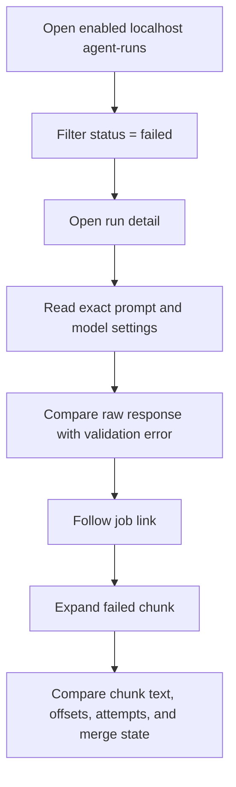
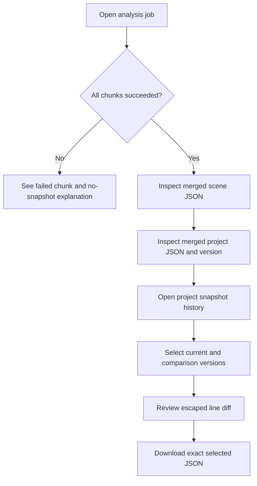
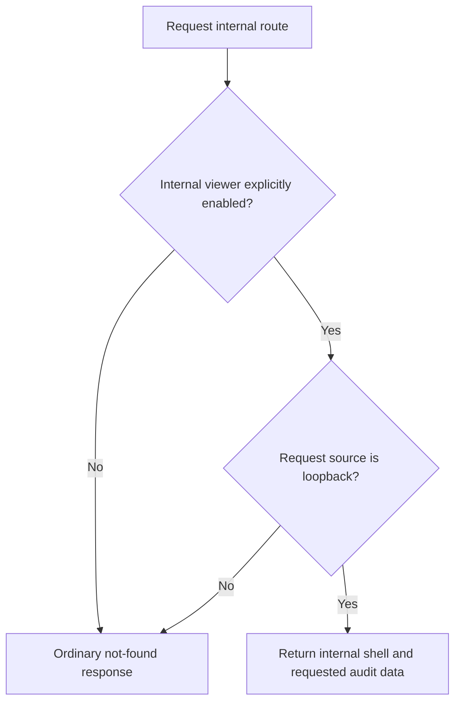

# Agent Audit Viewer UI Plan

## 1. Summary

Create a localhost-only internal diagnostic area for inspecting writing-agent
executions, background analysis jobs, and versioned relationship snapshot JSON.
The viewer exposes the exact rendered prompts and model responses needed to
audit an execution, while remaining visually and architecturally separate from
the writer-facing product.

The MVP stops at append-only SQLite audit records and JSON snapshots. It does
not display, generate, or project Neo4j nodes, relationships, or Cypher.

## 2. Context and Goals

### Target user

The application developer operating the backend locally and diagnosing prompt,
model, validation, retry, chunking, or snapshot-merge behavior.

### Primary tasks

1. Scan recent agent runs and identify a failed, slow, or unexpectedly costly
   execution.
2. Open one run and compare its exact rendered system/user messages with the
   raw response and Pydantic-validated JSON.
3. Open a background job and follow each 300-character/50-character-overlap
   chunk through its attempts and final merged JSON.
4. Inspect project snapshot versions, compare two versions, and download an
   exact JSON snapshot.

### Product boundary

This is an internal read-only diagnostic surface. It does not appear in the
main application header, library, writing workspace, or writer navigation. It
does not edit prompts, retry jobs, approve candidates, mutate a manuscript, or
change Story Bible facts.

## 3. Scope and Exclusions

### In scope

- `/internal/agent-runs`: newest-first run list with URL-owned filtering and
  pagination.
- `/internal/agent-runs/{run_id}`: complete audit record for one agent run.
- `/internal/analysis-jobs/{job_id}`: job status, chunk progress, linked run
  attempts, errors, and merged scene/project JSON.
- `/internal/relationship-snapshots/{project_id}`: version history, JSON
  inspection, comparison, and download.
- Visible agent, scene, job, run, project, snapshot, prompt, and chunk IDs.
- Exact prompt ID, version, SHA-256, fully rendered system/user messages,
  provider, model, settings, timing, token usage, raw response, validated JSON,
  retry attempts, and errors when present.
- Chunk metadata that proves the maximum 300-character size and 50-character
  overlap: sequence, absolute offsets, character count, content hash, and text.
- Loading, empty, not-found, disabled, access-denied, partial-data, and
  recoverable query-error states.
- Localhost-only and explicit-enable security messaging.

### Excluded

- Neo4j, graph projection, Cypher generation, or graph visualization.
- Prompt editing, version creation, or prompt activation.
- Job creation, cancellation, manual retry, replay, or deletion.
- Candidate approval/rejection and relationship or location-event editing.
- Audit-record or snapshot deletion and retention controls.
- Manuscript editing, Writing Assistant suggestions, or Story Bible editing.
- Streaming live model tokens or real-time tailing. A manual refresh retrieves
  the latest persisted state.
- Authentication/authorization for remote deployment. Outside local
  development the entire internal surface stays disabled unless a separate
  security design explicitly enables it.
- OpenAPI authorship or consumer contract decisions in this UI plan.

## 4. Requirements

| ID     | Requirement                                                                                                       | Acceptance signal                                                                                                                                                                                                            |
| ------ | ----------------------------------------------------------------------------------------------------------------- | ---------------------------------------------------------------------------------------------------------------------------------------------------------------------------------------------------------------------------- |
| REQ-1  | The internal viewer is available only when explicitly enabled and the request originates from a loopback address. | A locally enabled loopback request renders the viewer; disabled or non-loopback requests receive the backend's ordinary not-found response and no sensitive metadata.                                                        |
| REQ-2  | The run list makes executions identifiable and triageable.                                                        | Each row/card shows timestamp, status, agent type, run/job/scene IDs, prompt ID/version, provider/model, duration, and total token use, and links to the run and job details.                                                |
| REQ-3  | List filters are restorable and shareable locally.                                                                | Status, agent type, and page are validated query values; reload and Back/Forward reconstruct the same filter result, and invalid values canonicalize with replacement.                                                       |
| REQ-4  | A run detail exposes the exact LLM exchange and configuration.                                                    | The page shows complete rendered system and user messages, prompt SHA-256, provider/model/settings, timing/token fields, raw response, retry/error records, and validation outcome without truncating persisted content.     |
| REQ-5  | Validated JSON remains distinguishable from untrusted raw output.                                                 | Raw response and Pydantic-validated JSON are separate, explicitly labeled sections; a validation failure never appears as validated JSON.                                                                                    |
| REQ-6  | A job detail proves chunking and aggregation behavior.                                                            | The page shows maximum chunk size `300`, overlap `50`, ordered chunks with offsets/count/hash, every attempt status, and the merged scene/project snapshot JSON only when persisted.                                         |
| REQ-7  | Snapshot versions can be inspected, compared, and downloaded.                                                     | The project page lists immutable versions, selects a version through query values, defaults comparison to its immediate predecessor when one exists, renders an accessible line diff, and downloads the selected exact JSON. |
| REQ-8  | Reachable loading, empty, partial, error, and not-found states are explicit.                                      | Every route has the state specified in this plan, with retry only for failed reads and safe navigation back to the relevant parent view.                                                                                     |
| REQ-9  | Sensitive manuscript and prompt content is rendered safely.                                                       | User/model text is inserted as escaped text content, never interpreted as HTML; no audit payload is written to browser/server console logs by the viewer.                                                                    |
| REQ-10 | The viewer is read-only and isolated from product workflows.                                                      | No state-changing control or product-nav entry is present, and audit browsing cannot modify Manuscript, Story Bible, prompts, jobs, or snapshots.                                                                            |
| REQ-11 | The UI works with keyboard, screen reader, zoom, and narrow viewport use.                                         | Landmarks, headings, tables/lists, labels, focus order, status text, code-region names, and mobile reflow meet the accessibility behavior in this plan.                                                                      |

## 5. Confirmed Decisions

1. All persisted audit timestamps are shown as explicit ISO-8601 UTC values so
   the server-rendered result is unambiguous without client-side conversion.
2. Run and job statuses are backend-owned values. The UI supports at least
   `pending`, `running`, `succeeded`, `failed`, and `superseded`; an unknown
   future value renders as a neutral `Unknown: {value}` badge rather than
   failing the page.
3. Agent types support at least `scene-analysis` and
   `consistency-validation`; unknown types use their stored identifier.
4. The list defaults to newest first and does not auto-refresh. `Refresh`
   preserves the current URL filters and provides a visible updated-at value.
5. Full prompt and response content is intentionally visible because the
   surface is a local audit tool. Content is not redacted or visually truncated.
   Long values wrap inside a scrollable, selectable code block.
6. A run represents one model attempt. Retries belonging to the same logical
   chunk/job are linked and ordered by attempt number; the detail page shows
   both the current record and the retry chain.
7. A missing optional metric, such as provider token accounting, displays
   `기록되지 않음` rather than `0`.
8. Snapshot versions are immutable, append-only documents. The UI never labels
   a version as editable or deletable.
9. Snapshot diff is line-oriented JSON diff over consistently pretty-printed
   JSON. It is diagnostic, not a semantic graph diff.
10. The internal route family uses its own compact diagnostic header and has no
    link from the product application header; direct local URL entry is the
    intended entry point.
11. The viewer is rendered by backend HTML templates. Navigation and filtering
    use ordinary links and GET forms and remain within the backend boundary.
12. The enablement and loopback check is enforced before the backend renders
    any template or returns any audit payload. Hiding a link or template block
    alone does not satisfy REQ-1.
13. The backend view models and transport are approved separately. This plan
    defines visible fields and states but does not create an OpenAPI baseline.

## 6. Assumptions and Rationale

- Audit data is persisted before it appears. The HTML viewer reads SQLite
  audit rows and versioned JSON snapshots; it does not subscribe to an
  in-memory agent object.
- Ordinary full-page GET navigation is acceptable for filters, pagination,
  run/job links, and snapshot version selection. Small progressive enhancement
  may improve copy-to-clipboard or disclosure behavior, but every primary task
  works without client-side JavaScript.
- The backend supplies escaped template values and explicit view-model states.
  Templates do not infer `0`, success, or empty JSON from a missing value.
- The backend owns canonical query parsing and redirect behavior. Invalid query
  values redirect to the same route with only the invalid internal key removed
  or reset, preserving unrelated keys.
- Server-rendered pages may use repository color tokens as visual reference,
  but they use independent backend template and styling assets.

### Considered layout approaches

| Approach                                        | Decision and trade-off                                                                                                                                              |
| ----------------------------------------------- | ------------------------------------------------------------------------------------------------------------------------------------------------------------------- |
| Long-form audit document with anchored sections | **Selected.** Exact prompt, response, JSON, and retry evidence remain simultaneously searchable and comparable; anchors avoid hiding evidence behind stateful tabs. |
| Tabbed detail inspector                         | Rejected for MVP. It reduces vertical length but hides evidence, adds URL-owned tab state, and makes cross-section comparison slower.                               |
| Master/detail split pane                        | Rejected for MVP. It is efficient on wide monitors but becomes complex on mobile and makes deep links and browser history less predictable.                         |

## 7. Open Questions

None. The target, routes, read-only boundary, local-only security gate,
server-rendered delivery, JSON-only persistence scope, chunk evidence, and
snapshot comparison behavior are sufficiently defined for implementation.

## 8. Information Architecture

### Internal shell

Every enabled route uses the same internal shell:

- Skip link: `본문으로 건너뛰기`.
- Compact header with `Agent Audit`, an `내부 도구 · Local only` badge, and a
  manual `Refresh` action where the current page can change.
- Persistent warning under the header: `원고와 전체 프롬프트가 포함된 로컬
전용 화면입니다.`
- Breadcrumb navigation inside the internal route family.
- One page-level `h1`; section headings descend without skipped levels.
- No main product navigation or writing-workspace controls.

### IA inventory

| ID   | Route/surface                                   | Purpose                                                 | Primary content/actions                                                                                                                  | Requirements                      |
| ---- | ----------------------------------------------- | ------------------------------------------------------- | ---------------------------------------------------------------------------------------------------------------------------------------- | --------------------------------- |
| IA-1 | `/internal/agent-runs`                          | Triage and enter recent executions.                     | Filter bar, result count, run table/cards, pagination, refresh.                                                                          | REQ-1–REQ-3, REQ-8–REQ-11         |
| IA-2 | `/internal/agent-runs/{run_id}`                 | Audit one exact LLM attempt.                            | Identity/status summary, prompt/configuration, rendered messages, raw response, validated JSON or validation error, retry chain, errors. | REQ-1, REQ-4, REQ-5, REQ-8–REQ-11 |
| IA-3 | `/internal/analysis-jobs/{job_id}`              | Follow one scene analysis across chunks and merge.      | Job summary, chunking policy, ordered chunk list, linked attempts, scene snapshot, project snapshot, job errors.                         | REQ-1, REQ-5, REQ-6, REQ-8–REQ-11 |
| IA-4 | `/internal/relationship-snapshots/{project_id}` | Inspect immutable relationship snapshot history.        | Version selector/history, metadata, exact JSON, diff base, accessible diff, download.                                                    | REQ-1, REQ-7–REQ-11               |
| IA-5 | Disabled/non-loopback boundary                  | Avoid exposing the existence or contents of the viewer. | Ordinary not-found response; no internal shell, IDs, prompt metadata, or enablement hint.                                                | REQ-1, REQ-9, REQ-10              |

### Route and query contract

| Route                                           | Query values                                                                           | Canonical default and navigation behavior                                                                                                                                                                                                                        |
| ----------------------------------------------- | -------------------------------------------------------------------------------------- | ---------------------------------------------------------------------------------------------------------------------------------------------------------------------------------------------------------------------------------------------------------------- |
| `/internal/agent-runs`                          | `status`, `agent`, `page`                                                              | Missing filters mean all statuses/types and page 1. User filter/page changes push history. Explicit default, unsupported, non-scalar, or out-of-range values replacement-canonicalize by removing/resetting only the invalid internal key.                       |
| `/internal/agent-runs/{run_id}`                 | None; section links use stable fragment IDs such as `#messages` and `#validated-json`. | The path identifies the attempt. In-page anchor navigation does not change audit data.                                                                                                                                                                           |
| `/internal/analysis-jobs/{job_id}`              | None; chunks have fragment IDs such as `#chunk-0003`.                                  | The path identifies the job; linked run IDs navigate to IA-2.                                                                                                                                                                                                    |
| `/internal/relationship-snapshots/{project_id}` | `version`, `compare`                                                                   | Missing `version` selects latest. Missing `compare` selects the immediate predecessor when available. Selecting versions pushes history; invalid/nonexistent values replacement-canonicalize to valid defaults. `compare` is omitted when no predecessor exists. |

Query parsing accepts one scalar string per key. Repeated keys, arrays, blank
values, and unsupported values are invalid. Canonicalization preserves unrelated
search keys and does not announce a user error because recovery is automatic.

### Screen Specifications

### IA-1: Agent run list

#### Header and filters

- `h1`: `Agent runs`.
- Supporting text: `저장된 LLM 요청, 응답, 검증 결과를 실행 단위로
확인합니다.`
- Three controls in a labeled `실행 필터` region:
  - status native select: `전체 상태`, then known statuses;
  - agent native select: `전체 에이전트`, `Scene analysis`,
    `Consistency validation`;
  - `필터 초기화` button, disabled when already canonical defaults.
- Result count and last-refreshed time are text, not color-only indicators.

#### Desktop/tablet results

Use a semantic table with one row per run:

| Column   | Content                                                                  |
| -------- | ------------------------------------------------------------------------ |
| Started  | local timestamp plus exact ISO value                                     |
| Status   | icon + text badge                                                        |
| Agent    | human label and stored identifier if unknown                             |
| Identity | primary run ID link; secondary job and scene ID links/text               |
| Prompt   | prompt ID, `v{version}`, shortened visual SHA with full value accessible |
| Model    | provider/model                                                           |
| Usage    | duration and total tokens; missing values say `기록되지 않음`            |

The run ID link has an accessible name including agent and status, not only an
opaque UUID. Job ID is a link when present. Scene ID remains selectable text
until a dedicated scene audit route exists.

#### Mobile results

Below `md`, each run becomes a `Card` with the same fields in a labeled `dl`.
Status, started time, and agent appear first; IDs and metrics follow. `실행 상세
보기` is a full-width link button. Pagination remains below the card list.

#### Pagination

- `이전 페이지` and `다음 페이지` buttons with current `n / total` text.
- A disabled button remains focus-excluded and visually distinct.
- Page navigation moves focus to the `h1` or result-summary region after data
  settles; an `aria-live="polite"` summary announces the new result count.

### IA-2: Agent run detail

Sections appear in this order so the evidence reads from identity to input to
output:

1. **Run summary** — status, agent type, run/job/scene/chunk IDs, attempt
   number, started/ended/duration, and previous/next retry links.
2. **Prompt identity** — prompt ID, version, full SHA-256, result schema ID,
   and prompt source identity when persisted.
3. **Model configuration** — provider, model, and pretty-printed exact settings
   JSON. Missing token accounting remains visibly unknown.
4. **Rendered messages** — separately titled `System message` and `User
message` code regions containing the complete persisted strings. Each has a
   `Copy` button whose accessible name identifies the message; successful copy
   announces `복사됨` in a polite live region.
5. **Raw response** — untrusted provider response rendered as escaped plain
   text in a code region. It is never syntax-interpreted as HTML.
6. **Pydantic validation** — validation badge and either:
   - pretty-printed validated per-chunk JSON plus schema version; or
   - a destructive `Alert` with validation issues and no validated JSON panel.
7. **Retry and error history** — ordered attempts with attempt number, linked
   run ID, status, timing, and complete error type/message/structured details.
   If no retry occurred, show `재시도 없음` rather than hiding the section.

Every large code region has a visible label, `tabindex="0"`, soft wrapping by
default, and both horizontal and vertical scrolling when required. A small
`줄바꿈` toggle may change presentation only; because it is ephemeral and does
not change which evidence is visible, it need not enter the URL.

### IA-3: Analysis job detail

#### Job summary

- Status, job/project/scene IDs, manuscript revision, analysis/schema version,
  created/started/finished times, and job duration.
- Chunking policy card: `최대 300자`, `50자 겹침`, total source characters,
  total chunks, completed/failed counts.
- If the job was superseded, show the superseding job/revision link when
  persisted and explain that no new snapshot was committed from this job.

#### Chunk list

Chunks appear in source order. Each native `<details>` summary includes:

- chunk sequence and ID;
- absolute `[start_offset, end_offset)` range;
- character count and 50-character overlap with the preceding chunk (`0` for
  the first chunk);
- status and attempt count;
- short visual content-hash prefix with the full hash available in the body.

The expanded body shows complete escaped chunk text, full content hash,
validated JSON or validation error, and ordered linked run attempts. Failed
chunks use an icon, text status, and destructive border; color alone is never
the differentiator.

#### Merge results

- `Merged scene snapshot JSON`: appears only if that immutable snapshot was
  persisted.
- `Merged project snapshot JSON`: appears only if the project merge completed
  and was persisted, with snapshot version and a link to IA-4.
- If any chunk failed, replace absent merge panels with an explanatory neutral
  state: `모든 청크가 성공하지 않아 snapshot을 생성하지 않았습니다.`
- If merge/storage failed after all chunk runs, show the stage-specific error
  and retain the successfully validated per-chunk evidence above.

This route contains no projection stage, graph status, Neo4j ID, or Cypher
panel.

### IA-4: Relationship snapshot history

#### Version navigation

- `h1`: `Relationship snapshots` with project ID.
- Native `현재 버전` select lists version, creation time, source scene/revision,
  and immutable status.
- Native `비교 기준` select lists other available versions. It defaults to the
  immediately preceding version and cannot select the same version.
- Previous/next version buttons provide faster sequential browsing and update
  the canonical URL.

#### Selected snapshot

- Metadata card: project ID, snapshot version, created time, source job/scene
  revision, schema version, content SHA-256, and byte size.
- `JSON 다운로드` is an ordinary link/download action with an accessible file
  name such as `project-{project_id}-relationships-v{version}.json`. The
  downloaded body must be the exact persisted snapshot, not a reconstruction
  from rendered text.
- Exact pretty-printed snapshot JSON appears in a labeled escaped code region.

#### Diff

- Summary gives added, removed, and unchanged line counts as text.
- A line-oriented diff is an ordered list or table with line number, change
  type (`추가`, `삭제`, `변경 없음`), and escaped JSON text.
- `+`/`-` markers and screen-reader text accompany color. Added and removed
  backgrounds meet contrast requirements but are not the only cue.
- On mobile the diff remains one scrollable monospace region rather than
  collapsing into side-by-side columns.
- With only one version, show the JSON and download action while replacing diff
  controls with `비교할 이전 버전이 없습니다.`

## 9. User Flow

### Triage a failed chunk



### Inspect a snapshot merge



### Access boundary



## 10. Wireframes

### Desktop — run list

```text
+------------------------------------------------------------------------------+
| Agent Audit  [내부 도구 · Local only]                              [Refresh] |
| 원고와 전체 프롬프트가 포함된 로컬 전용 화면입니다.                         |
+------------------------------------------------------------------------------+
| Agent runs                                                                  |
| 저장된 LLM 요청, 응답, 검증 결과를 실행 단위로 확인합니다.                 |
| [상태: Failed v] [에이전트: 전체 v] [필터 초기화]        12개 · 14:32 갱신 |
+------------------------------------------------------------------------------+
| Started | Status | Agent | Run / Job / Scene | Prompt | Model | Usage       |
| 14:31   | Failed | Scene | run-…              | v3 sha | model | 1.2s / —    |
| 14:29   | Success| Consistency | run-…        | v2 sha | model | 850ms/1,240 |
+------------------------------------------------------------------------------+
| [이전 페이지]                         1 / 3                  [다음 페이지]   |
+------------------------------------------------------------------------------+
```

### Desktop — run detail

```text
+------------------------------------------------------------------------------+
| Agent Audit [Local only]                                      [Refresh]      |
| Runs / run-0182                                                              |
+------------------------------------------------------------------------------+
| Agent run                                         [Failed]                   |
| Run / Job / Scene / Chunk IDs | attempt 2 | timing | token use              |
+-------------------------------+----------------------------------------------+
| Prompt identity               | Model configuration                          |
| scene-analysis v3             | provider / model / exact settings JSON       |
| SHA-256: full value           |                                              |
+-------------------------------+----------------------------------------------+
| System message                                                [Copy]         |
| +--------------------------------------------------------------------------+ |
| | complete escaped rendered message; selectable, wrapping, scrollable     | |
| +--------------------------------------------------------------------------+ |
| User message                                                  [Copy]         |
| +--------------------------------------------------------------------------+ |
| | complete escaped manuscript-bearing message                              | |
| +--------------------------------------------------------------------------+ |
| Raw response                                                                 |
| +--------------------------------------------------------------------------+ |
| | untrusted provider text                                                  | |
| +--------------------------------------------------------------------------+ |
| Pydantic validation [Failed]                                                 |
| [!] validation issues; no validated JSON is shown                            |
| Retry and error history                                                      |
+------------------------------------------------------------------------------+
```

### Desktop — analysis job

```text
+------------------------------------------------------------------------------+
| Analysis job job-102                                      [Running] [Refresh]|
| Project / Scene / Revision / Analysis version                                |
+----------------------+-------------------------------------------------------+
| Chunking policy      | Progress                                               |
| max 300 · overlap 50 | 3 / 5 succeeded · 1 running · 1 pending               |
+----------------------+-------------------------------------------------------+
| > Chunk 0001 · [0,300)   · 300 chars · Success · 1 attempt                  |
| v Chunk 0002 · [250,550) · 300 chars · Failed  · 2 attempts                 |
|   complete escaped chunk text                                                |
|   validated JSON / validation error · linked run attempts                    |
| > Chunk 0003 · [500,800) · 300 chars · Pending                              |
+------------------------------------------------------------------------------+
| Merged scene snapshot                                                        |
| 모든 청크가 성공하지 않아 snapshot을 생성하지 않았습니다.                  |
+------------------------------------------------------------------------------+
```

### Desktop — snapshot history

```text
+------------------------------------------------------------------------------+
| Relationship snapshots · project-07                              [Refresh]    |
| [현재 버전: v18 v] [비교 기준: v17 v] [이전] [다음] [JSON 다운로드]        |
+-------------------------------+----------------------------------------------+
| Snapshot metadata             | Diff summary                                  |
| version/schema/hash/size      | +12 added · -4 removed · 318 unchanged        |
+-------------------------------+----------------------------------------------+
| Exact snapshot JSON                                                          |
| { ... escaped, selectable, scrollable ... }                                  |
+------------------------------------------------------------------------------+
| Diff                                                                         |
| 112  - 삭제  "description": "..."                                         |
| 112  + 추가  "description": "..."                                         |
+------------------------------------------------------------------------------+
```

### Mobile — run card and detail

```text
+--------------------------------------+
| Agent Audit              [Local only]|
| 민감한 로컬 전용 화면                |
+--------------------------------------+
| Agent runs                           |
| [상태 v] [에이전트 v]                |
| +----------------------------------+ |
| | [Failed] Scene analysis          | |
| | 2026-... · 1.2s · tokens unknown | |
| | Run  run-0182                    | |
| | Job  job-102                     | |
| | Scene scene-08                   | |
| | [실행 상세 보기]                 | |
| +----------------------------------+ |
+--------------------------------------+

+--------------------------------------+
| Runs / run-0182                      |
| Agent run                   [Failed] |
| [summary fields stack as dl]         |
| System message              [Copy]   |
| +----------------------------------+ |
| | wrapped escaped text             | |
| +----------------------------------+ |
| Raw response                        |
| +----------------------------------+ |
| | horizontally scrollable JSON     | |
| +----------------------------------+ |
| Pydantic validation                 |
| [error alert]                       |
+--------------------------------------+
```

### Mobile — snapshot diff

```text
+--------------------------------------+
| Relationship snapshots              |
| project-07                           |
| [현재 v18                 v]         |
| [비교 v17                 v]         |
| [JSON 다운로드]                     |
| +12 추가 · -4 삭제                  |
| +----------------------------------+ |
| | 112 - 삭제 ...                   | |
| | 112 + 추가 ...                   | |
| |       scroll horizontally  →     | |
| +----------------------------------+ |
+--------------------------------------+
```

## 11. Responsive Behavior

- Base/mobile uses one column, full-width controls, run cards, stacked `dl`
  fields, and horizontally scrollable code/diff regions.
- At `md`, run cards switch to a semantic table and filter controls share a
  row. Summary cards may form two columns.
- At `lg`, metadata and model/prompt identity can use two columns, but message,
  response, JSON, and diff evidence remain full width.
- No information disappears by breakpoint. Visually shortened hash/ID text
  always retains an accessible full value and remains selectable in detail.
- The layout supports 200% browser zoom without two-dimensional page scrolling;
  only explicitly labeled code and diff regions may scroll horizontally.
- Sticky headers are not required for MVP; avoiding them prevents code-region
  focus and zoom from being obscured.

## 12. UI States

| State                        | Run list                                                                                                                                                                                         | Run detail                                                                                     | Job detail                                                                                                                               | Snapshot history                                                                                                                         |
| ---------------------------- | ------------------------------------------------------------------------------------------------------------------------------------------------------------------------------------------------ | ---------------------------------------------------------------------------------------------- | ---------------------------------------------------------------------------------------------------------------------------------------- | ---------------------------------------------------------------------------------------------------------------------------------------- |
| Loading                      | Ordinary navigation uses the browser's document-loading indicator. If progressively enhanced, retain current results, mark the region `aria-busy`, and announce `실행 목록을 불러오는 중입니다.` | Ordinary link navigation uses the browser indicator; no fake prompt content.                   | Ordinary link navigation uses the browser indicator; enhanced refresh keeps persisted chunks visible and marks the updating region busy. | Ordinary link navigation uses the browser indicator; enhanced refresh retains the selected immutable version until the response arrives. |
| Empty                        | `아직 저장된 agent run이 없습니다.` Filters reset action only if filters are active.                                                                                                             | Not applicable.                                                                                | No chunks is a neutral state only for a persisted pending job.                                                                           | `저장된 relationship snapshot이 없습니다.` No disabled fake download.                                                                    |
| Filtered empty               | `조건에 맞는 실행이 없습니다.` with `필터 초기화`.                                                                                                                                               | Not applicable.                                                                                | Not applicable.                                                                                                                          | Not applicable.                                                                                                                          |
| Disabled controls            | First/last-page navigation and canonical-default filter reset are native-disabled or omitted with an adjacent page/result explanation.                                                           | Copy enhancement is omitted when scripting is unavailable; manual selection remains available. | Pending chunks have no run link until a persisted run ID exists.                                                                         | Previous/next and compare controls are disabled or omitted when no valid target exists; download is omitted without a persisted version. |
| Validation failed            | Failure status remains triageable.                                                                                                                                                               | Raw response and Pydantic issues render; the validated JSON region is explicitly absent.       | The affected chunk shows issues and attempts; merge panels explain why no snapshot was committed.                                        | No phantom snapshot version appears.                                                                                                     |
| Read error                   | Semantic error status block, safe summary, `다시 시도`.                                                                                                                                          | Preserve route identity; error status block and `실행 목록으로`.                               | Error status block and linked run/list navigation when known from route only.                                                            | Error status block and retry; no stale download presented as current.                                                                    |
| Not found                    | Not-found Alert with `실행 목록으로`.                                                                                                                                                            | Unknown run ID is echoed only as escaped text.                                                 | Unknown job ID is escaped; link to run list.                                                                                             | Unknown project ID is escaped; link to run list.                                                                                         |
| Running/partial              | Running badge and missing metrics say `기록되지 않음`.                                                                                                                                           | Persisted sections render; absent response/JSON says `아직 기록되지 않음`.                     | Completed chunks remain inspectable; pending chunks have explicit state; merge panels explain they are waiting.                          | Only immutable completed snapshots appear.                                                                                               |
| Failed                       | Failed badge; row remains navigable.                                                                                                                                                             | Raw response, validation, retry, and error evidence remain visible independently.              | Successful chunk evidence remains; absent snapshots explain why.                                                                         | Snapshot versions already committed remain available; a failed job does not create a phantom version.                                    |
| Superseded                   | Superseded badge and newer job reference when available.                                                                                                                                         | Stored evidence remains readable.                                                              | Explain no snapshot commit and link to superseding job.                                                                                  | No special phantom version.                                                                                                              |
| Viewer disabled/non-loopback | Ordinary not-found response; no internal UI.                                                                                                                                                     | Same.                                                                                          | Same.                                                                                                                                    | Same.                                                                                                                                    |

Error text must not include a stack trace, filesystem path, environment value,
or raw SQLite error. Those details may appear only when they were deliberately
persisted as the audited agent error and the loopback/enablement gate has
already succeeded.

## 13. Accessibility

- Use semantic `header`, `nav`, `main`, `section`, `table`, `dl`, `pre`, and
  native `details/summary` elements. The desktop table has a caption (visible
  or screen-reader-only) and scoped column headers.
- Every icon has adjacent text or an accessible name. Status always combines
  icon, label, and badge treatment; green/red alone is insufficient.
- Focus order follows visible order. Filter updates and pagination preserve a
  predictable focus target. Native details summaries, selects, links, and
  buttons remain keyboard operable.
- Code regions use `<pre><code>` with manuscript/model strings rendered as text
  nodes. Do not mark these values as safe HTML, apply markdown rendering, use
  syntax highlighters that inject raw HTML, or interpolate them into executable
  markup.
- JSON pretty-printing operates on already validated/parsed data. Raw response
  remains escaped plain text even when it resembles JSON or HTML.
- Copy success and list-result changes use separate polite live regions.
  Errors use Alert semantics without repeatedly announcing on every render.
- Provide visible focus rings using existing theme tokens. Ensure code/diff
  text, status badges, muted metadata, and added/removed diff treatments meet
  WCAG AA contrast.
- Use `aria-label` or visible labels that distinguish repeated `Copy`, `Open
run`, and version actions. Do not use UUIDs as the only accessible context.
- All content remains selectable. Do not mask full prompt/message text behind a
  hover-only tooltip.
- The viewer must not call `console.log`, `console.debug`, or error reporters
  with prompt, manuscript, response, validated JSON, or snapshot payloads.

## 14. shadcn/ui Status and Adoption Assumptions

Repository evidence: `frontend/components.json` configures shadcn
`radix-nova`, CSS variables, Tailwind, and Lucide, and the repository contains
a local frontend primitive inventory. That evidence belongs to the separate
writer-facing product UI.

shadcn/ui is **not applicable** to this backend-rendered target. The internal
viewer must not import product UI primitives, add a frontend bundle, or require
frontend package changes. Backend templates use
semantic HTML and small internal styling assets introduced under the backend
implementation boundary.

| UI need                    | Backend-rendered mapping                                                                 | Adoption decision                                                                    |
| -------------------------- | ---------------------------------------------------------------------------------------- | ------------------------------------------------------------------------------------ |
| Internal shell and warning | Template landmarks, text badge, warning block, ordinary link/button styling              | Backend-local template and CSS; no product header or shadcn primitive.               |
| Run list                   | Semantic `<table>` at wider widths and repeated `<article>`/`dl` cards on mobile         | Render both from the same view model; CSS chooses the presentation.                  |
| Filters/version selectors  | Labeled GET `<form>` and native `<select>` controls                                      | Works without JavaScript; no Select package.                                         |
| Status                     | Text label plus backend CSS class and optional decorative inline SVG                     | Unknown status receives a neutral fallback; no Lucide runtime dependency.            |
| Loading/error/empty        | Server-rendered status templates; optional refresh response placeholder only if enhanced | No skeleton library. Full navigation normally returns the complete next document.    |
| Breadcrumbs                | `<nav aria-label="Breadcrumb"><ol>` with ordinary `<a href>` links                       | No router-link abstraction.                                                          |
| Chunk expansion            | Native `<details>/<summary>`                                                             | No Accordion/Collapsible dependency.                                                 |
| Prompt/response/JSON       | Escaped `<pre><code>` inside a styled `<section>`                                        | No syntax-highlighting or code-viewer dependency.                                    |
| Snapshot diff              | Semantic line list/table in an overflow container                                        | Backend builds deterministic diff-line view models; no external frontend package.    |
| Copy action                | Plain button with a tiny optional progressive-enhancement script                         | Hidden or inert without JavaScript; selecting and copying text manually still works. |

Backend styling may visually echo the repository's neutral palette and focus
treatment, but it is an independent, minimal asset. No shadcn adoption task or
frontend dependency is part of this feature.

## 15. Component Structure

“Component” in this server-rendered plan means a backend template partial plus
an explicit view model, not a client application component.

| Template/view-model unit          | Responsibility                                                                                        | Required inputs                                                                                            | Request/query state and emitted navigation                                                         |
| --------------------------------- | ----------------------------------------------------------------------------------------------------- | ---------------------------------------------------------------------------------------------------------- | -------------------------------------------------------------------------------------------------- |
| `internal_audit/layout`           | Local-only shell, skip link, warning, page title, CSS asset, optional progressive-enhancement script. | Title, breadcrumb items, refreshed-at value, environment badge.                                            | No local state; refresh is an ordinary GET to the current canonical URL.                           |
| `internal_audit/_breadcrumb`      | Ordinary internal-route links with current-page text.                                                 | Ordered label/href items.                                                                                  | Emits GET navigation to the selected ancestor.                                                     |
| `internal_audit/_status_badge`    | Known/unknown status text, non-color cue, backend CSS class.                                          | Raw status and mapped human label.                                                                         | No state or action.                                                                                |
| `internal_audit/run_list`         | GET filter form, result summary, desktop table, mobile cards, pagination.                             | Canonical filters, run summary rows, total/page links.                                                     | Query owns `status`, `agent`, and `page`; form submit and pagination emit ordinary GET navigation. |
| `internal_audit/run_detail`       | Ordered run evidence sections and stable anchors.                                                     | Run summary, prompt identity, model settings, messages, raw response, validation result, retry/error rows. | Path owns `run_id`; links emit job/run GET navigation and anchors move within the document.        |
| `internal_audit/job_detail`       | Job summary, chunking policy, ordered chunk partials, merge outcomes.                                 | Job view model, chunk rows, persisted scene/project snapshots, stage error.                                | Path owns `job_id`; links emit run/snapshot GET navigation.                                        |
| `internal_audit/_chunk`           | Native disclosure for one chunk and its linked attempts.                                              | Sequence, IDs, offsets, count, overlap, hash, text, validation result, attempts.                           | Native disclosure state is document-local; attempt links emit run GET navigation.                  |
| `internal_audit/snapshot_history` | Version GET form, metadata, exact JSON, diff, download link.                                          | Canonical selected/base versions, snapshot metadata/body, diff rows, download href.                        | Query owns `version` and `compare`; selectors emit GET navigation and download emits a file GET.   |
| `internal_audit/_code_region`     | Consistent named, focusable, escaped prompt/response/JSON block.                                      | Visible label, stable anchor, already serialized plain text, optional copy-control ID.                     | No required state; optional copy enhancement emits only local polite feedback.                     |
| `internal_audit/_empty_or_error`  | Route-appropriate empty, not-found, query-error, partial, or unavailable state.                       | Semantic status kind, safe copy, retry/back href when allowed.                                             | Retry/back actions emit ordinary safe GET navigation.                                              |

View models expose display-ready distinctions rather than making templates
guess. In particular, token usage uses `known/value` versus `unknown`; Pydantic
validation uses a discriminated valid/invalid/not-yet-recorded result; snapshot
presence is distinct from empty JSON; and errors carry safe user-facing text
separately from persisted audited details.

The backend template engine's autoescape remains enabled. `_code_region`
accepts plain strings and never marks manuscript, prompt, response, error, or
JSON content as safe HTML.

## 16. Requirement Traceability Matrix

| Requirement | Planned surfaces | Visible evidence                                                                           | Primary verification                                                               |
| ----------- | ---------------- | ------------------------------------------------------------------------------------------ | ---------------------------------------------------------------------------------- |
| REQ-1       | IA-1–IA-5        | Internal shell only after enabled loopback gate; ordinary not-found otherwise.             | Enablement/loopback integration tests and no-payload response assertion.           |
| REQ-2       | IA-1             | Complete desktop row/mobile card identity and metrics.                                     | Summary fixtures for known, missing, and unknown values.                           |
| REQ-3       | IA-1             | GET form selections, canonical pagination links, result summary.                           | Direct URL, redirect canonicalization, reload, Back, and Forward tests.            |
| REQ-4       | IA-2             | Prompt identity, exact messages/config, raw response, tokens/timing, retry/error sections. | Full-content detail fixture and optional copy enhancement test.                    |
| REQ-5       | IA-2, IA-3       | Separately labeled raw and validated regions; invalid state has issues only.               | Valid, invalid, and not-yet-recorded Pydantic fixtures.                            |
| REQ-6       | IA-3             | Policy card, offsets/count/overlap/hash/text, attempts, merge panels.                      | 300/50 boundaries, short final chunk, partial job, and merge outcome tests.        |
| REQ-7       | IA-4             | Version/base selects, exact JSON, line diff, exact download.                               | Version canonicalization, first version, diff records, download byte/hash tests.   |
| REQ-8       | IA-1–IA-4        | Every state in Section 12 has route-specific copy and navigation.                          | Server-rendered template/view tests for the full state matrix.                     |
| REQ-9       | IA-1–IA-5        | Escaped text-only code regions and no sensitive console output.                            | Malicious-payload escaping, CSP if configured, and no-console assertions.          |
| REQ-10      | IA-1–IA-4        | Only GET navigation/download/copy controls; no product entry point.                        | Method/control audit and no mutation request tests.                                |
| REQ-11      | IA-1–IA-4        | Landmarks, headings, labels, tables/lists, focus, status cues, reflow.                     | Keyboard, semantics, zoom, narrow viewport, and progressive-enhancement-off tests. |

### Persisted evidence placement

| Persisted evidence                    | List                   | Run detail                        | Job detail                | Snapshot history        |
| ------------------------------------- | ---------------------- | --------------------------------- | ------------------------- | ----------------------- |
| Agent/run/job/scene/chunk/project IDs | Core identity          | Full identity                     | Full identity             | Project/source identity |
| Status and timestamps                 | Summary                | Exact                             | Exact and progress        | Snapshot creation       |
| Prompt ID/version/SHA                 | Summary                | Full                              | Via linked attempts       | Not applicable          |
| Rendered system/user messages         | Not shown              | Complete escaped text             | Via linked run            | Not applicable          |
| Provider/model/settings               | Summary provider/model | Complete                          | Via linked attempts       | Not applicable          |
| Timing/token use                      | Summary                | Complete with unknown state       | Attempt roll-up and links | Not applicable          |
| Raw response                          | Not shown              | Complete escaped text             | Via linked attempt        | Not applicable          |
| Validated per-chunk JSON              | Not shown              | Complete when valid               | Complete per chunk        | Not applicable          |
| Chunk offsets/count/hash/text         | Not shown              | Current chunk identity if present | Complete ordered set      | Source metadata only    |
| Merged scene snapshot JSON            | Not shown              | Not shown                         | Complete when persisted   | Not applicable          |
| Merged project snapshot JSON          | Not shown              | Not shown                         | Complete when persisted   | Exact selected version  |
| Retries/errors                        | Failure indicator      | Complete ordered chain            | Per chunk and job stage   | Not applicable          |
| Snapshot version/diff/download        | Not shown              | Not shown                         | Link/version              | Complete                |

## 17. Implementation Considerations

- Apply the explicit-enable and loopback gate before route dispatch, template
  rendering, SQLite reads, snapshot file reads, or static audit-asset delivery.
- Treat proxy headers as untrusted unless the deployment has an explicit
  trusted-proxy configuration; a client-supplied forwarded address must not
  turn a remote request into a loopback request.
- Use GET for list filters, pagination, version selection, detail navigation,
  refresh, and exact snapshot download. The MVP exposes no state-changing POST,
  PUT, PATCH, or DELETE form.
- Keep prompt/message/response/snapshot values out of access-log query strings,
  exception messages, server console logs, browser console calls, analytics,
  and error reporters. IDs and non-sensitive filter values belong in URLs;
  manuscript content does not.
- Configure response headers suitable for sensitive local pages: at minimum
  `Cache-Control: no-store`, `X-Content-Type-Options: nosniff`, a restrictive
  Content Security Policy compatible with backend-local assets, and no framing.
- Derive display models in backend code. Templates render values and branch on
  explicit states; they do not parse provider responses or merge JSON.
- Pretty-print validated JSON and snapshots deterministically before rendering
  or diffing. Raw provider response remains untrusted plain text.
- The exact snapshot download reads the persisted immutable bytes (or the
  canonical persisted JSON representation defined by storage), sets a safe
  filename and JSON content type, and never rebuilds from HTML.
- A lightweight backend CSS file supplies layout, focus, status, code-region,
  and responsive styles. Optional JavaScript is limited to copy feedback or
  similarly nonessential progressive enhancement and carries no audit payload
  into logs or storage.
- Direct-load each enabled route and verify its page heading, identity, and
  local-only warning. Test disabled/non-loopback responses before testing
  templates.
- Verify filters and version comparison through ordinary links/forms, redirects,
  reload, Back, Forward, invalid values, first/last pages, and first snapshot.
- Verify loading only if progressive enhancement performs an in-page fetch;
  ordinary full-page navigation otherwise uses the browser's native document
  loading state. Empty, error, not-found, running, failed, superseded,
  validation-failed, and partial-job states remain mandatory server-rendered
  fixtures.
- Render payloads containing `<script>`, event-handler attributes, HTML
  entities, markdown, bidirectional text, and long unbroken strings; confirm
  inert output and safe reflow.
- Verify no console, telemetry, access-log query, or generic error report
  contains prompt, manuscript, response, validated JSON, or snapshot content.
- Exact internal data-access interfaces, page size, and download response
  details require main-agent approval in the backend implementation brief.
- Neo4j and Cypher remain deferred. Adding projection status, graph data, or a
  graph visualization requires a replacement UI-plan approval.

## 18. Self-review Results

- **Section structure:** exactly 18 required top-level sections are present in
  the required order; screen specifications remain a subsection of Information
  Architecture.
- **Delivery target:** all route, navigation, query, rendering, and component
  guidance now targets backend server-rendered HTML with ordinary links/forms
  and optional minimal progressive enhancement.
- **Frontend boundary:** repository shadcn evidence is recorded only to explain
  non-adoption. No product frontend implementation or dependency is required.
- **Scope:** all four internal audit routes are covered; SQLite append-only
  records and versioned JSON snapshots remain in scope; Neo4j/Cypher remains
  excluded.
- **Security:** explicit enablement, loopback enforcement, safe escaping,
  read-only methods, no-store behavior, and sensitive-log prohibitions agree
  across requirements, flows, states, accessibility, and implementation notes.
- **Completeness:** no placeholder, contradictory mutation control, hidden
  required evidence, or unresolved UI decision remains.
