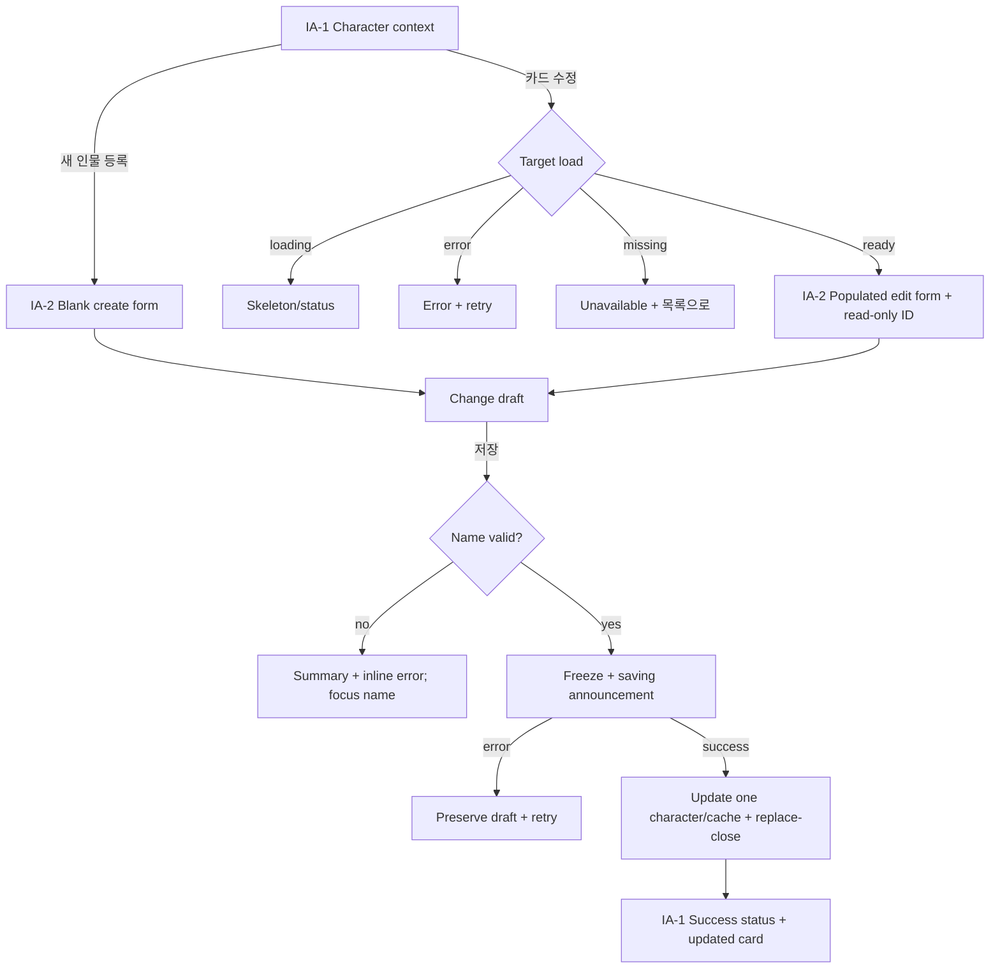
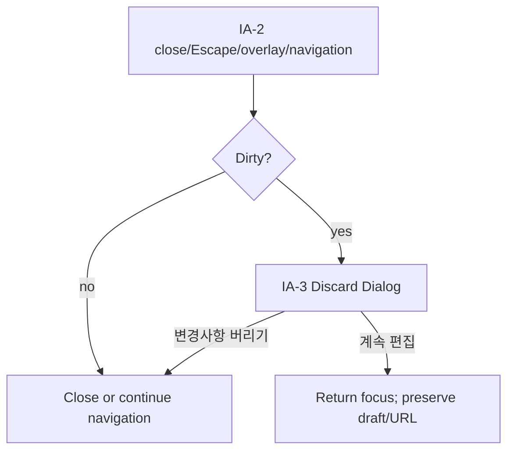

# Character Card Create/Edit UI Plan

## 1. Summary

`/projects/{projectId}/write?tab=characters`의 기존 `StoryContextPanel`에서 작가가 새 인물을 등록하고 초기 두 주인공을 포함한 모든 기존 인물을 한 명씩 수정한다. 오른쪽 편집 Sheet에서 character-scoped save를 수행하며 서버 생성 ID는 불변이다. 이 문서는 화면 계획만 정의한다.

## 2. Context and Goals

- **사용자:** 집필 중 Story Bible 인물 기준 정보를 관리하는 로맨스 작가.
- **문제:** 현재 인물 카드는 읽기 전용이라 작업공간을 벗어나지 않고 추가·수정할 수 없다.
- **결과/주요 작업:** `등장인물` 목록에서 등록 또는 수정을 열고, 한 인물의 기준 정보를 저장한 뒤 최신 카드를 확인한다.
- **기존 맥락:** `<768px`에서는 Context가 왼쪽 Sheet, 그 이상에서는 인라인/resize 패널이다. 가장 가까운 편집 패턴은 `worldbuilding-edit-add.md`의 오른쪽 Sheet와 dirty-discard 흐름이다.

## 3. Scope and Exclusions

**포함:** 등록, 모든 기존 인물 수정, 이름(필수), 성별·나이(문자열)·역할·성격·문체·대사 스타일·기본 욕망·숨은 감정(선택), 불변 ID 표시, 인물 단위 저장, loading/error/success/dirty-discard, desktop/mobile/a11y.

**제외:** 삭제·정렬·일괄 편집, conflict/merge/force-save UI, 장면별 욕망·의도·known/unknown/forbidden 정보, 이전 기억/Narrative Memory, 관계·장면 참조, AI 생성, API/도메인/파일 저장 구현.

## 4. Requirements

| ID     | 수용 신호                                                                                                         |
| ------ | ----------------------------------------------------------------------------------------------------------------- |
| REQ-01 | populated/empty 목록에 `새 인물 등록`, 모든 카드(초기 두 주인공 포함)에 대상명이 포함된 `인물 수정`이 있다.       |
| REQ-02 | 공통 폼은 이름(필수)과 8개 선택 문자열 필드를 label과 함께 제공하며 나이는 text input이다.                        |
| REQ-03 | 생성은 빈 draft로 시작하고 client ID를 만들지 않으며, 수정은 최신 값과 서버 ID를 읽기 전용으로 표시한다.          |
| REQ-04 | trim 후 빈 이름은 저장하지 않고 summary/inline error를 보인다. 선택 필드에 임의 형식·길이 제한을 추가하지 않는다. |
| REQ-05 | 저장은 한 인물만 변경/추가하고 다른 인물과 ID를 보존한다. 중복 제출을 막고 성공 응답을 authoritative로 반영한다.  |
| REQ-06 | last-save-wins를 따르며 conflict 감지·비교·덮어쓰기 UI를 제공하지 않는다.                                         |
| REQ-07 | 실패 시 draft/ID를 보존하고 재시도한다. 성공 시 Sheet를 닫고 갱신·상태 메시지를 알린다.                           |
| REQ-08 | dirty close/Escape/overlay/tab·route 이동은 discard 확인을 거치고 clean close는 즉시 수행한다.                    |
| REQ-09 | loading/read error/not-found/disabled/saving/success 상태를 desktop/mobile에서 동등하게 제공한다.                 |
| REQ-10 | 폼·consumer data·결과 UI는 Story Bible 기준 정보만 다루며 제외된 장면 상태와 기억을 포함하지 않는다.              |

## 5. Confirmed Decisions

- 새 route가 아닌 기존 character tab을 확장한다. 생성과 수정은 동일 필드 순서의 Sheet composition을 쓴다.
- 이름만 필수이고 나이를 포함한 나머지는 선택 문자열이다. 삭제와 conflict UI는 없다.
- 수정 ID는 `인물 ID` 읽기 전용 text/code이며 저장·재조회 대상을 식별한다. 생성 ID는 성공 응답만 신뢰한다.
- save scope는 character 하나이고 동일 대상을 연속 저장하면 마지막 성공 응답이 최신 표시값이다.

## 6. Assumptions and Rationale

- 프런트 규칙에 따라 Sheet의 user-visible 상태를 URL search로 복원한다. 예: `panel=character-editor`, `mode=create|edit`, edit의 `characterId`; 정확한 이름은 route 구현 시 기존 validator와 승인된 계약에 맞춘다.
- 명시적 open/close는 history entry, 저장 성공과 invalid search canonicalization은 replace로 처리해 Back이 완료 폼을 재개하지 않게 한다.
- 성별·나이·역할은 `Input`, 장문 가능 필드는 `Textarea`를 사용한다. 계약에 없는 enum/숫자 변환을 만들지 않는다.
- toast primitive가 없으므로 목록 상단의 polite status를 성공 피드백으로 사용한다.

## 7. Open Questions

- `story-bible.md`는 현재 인물의 이름·역할·욕망·숨은 감정만 정의하고 인물 추가/수정 및 나머지 필드를 정의하지 않는다. 구현 전 도메인 계약 동기화가 필요하다.
- 메인 에이전트/OpenAPI agent가 create/update operation, optional/normalization 규칙, 오류·not-found 의미, authoritative 응답을 승인해야 한다. 이 문서는 transport shape나 authorization을 정하지 않는다.

## 8. Information Architecture

- **IA-1 Character context:** tab/direct link/editor 종료로 진입. 제목 → 등록 action → status → cards/empty/error. 카드별 수정 action. REQ-01,05,07,09.
- **IA-2 Character editor Sheet:** IA-1/direct URL로 진입. 고정 header → identity/feedback → scroll form → footer. 생성/수정, 저장/재시도/닫기. REQ-02~10.
- **IA-3 Discard Dialog:** dirty close/navigation에서 진입. 결과 설명 → `계속 편집` → `변경사항 버리기`. cancel은 draft/URL 유지. REQ-08,09.

## 9. User Flow





## 10. Wireframes

Desktop (`>=768px`):

```text
┌─ Character context ──────────┬──── Manuscript ────┬─ Editor Sheet ───────┐
│ 등장인물   [새 인물 등록]   │                    │ 지우 수정          × │
│ ┌ 지우 · 주인공  [수정] ┐   │                    │ 인물 ID  chr_…       │
│ └ 숨은 감정 요약         ┘   │                    │ 이름* [지우_______]  │
│ ┌ 현우 · 주인공  [수정] ┐   │                    │ 성별 [__] 나이 [__] │
│ └────────────────────────┘   │                    │ 역할 [____________] │
│ [status/error or empty]      │                    │ 성격 [____________] │
│                              │                    │ 문체/대사/욕망/감정  │
│                              │                    │ [취소]       [저장] │
└──────────────────────────────┴────────────────────┴──────────────────────┘
```

Mobile (`<768px`):

```text
┌─ full-width editor Sheet ─────────────┐
│ 새 인물 등록                       × │
│ 저장하면 인물 ID가 생성됩니다.       │
│ [alert/status]                        │
│ 이름* [____________________________]  │
│ 성별  [____________] 나이 [________] │
│ 역할  [____________________________] │
│ 성격/문체/대사 스타일/기본 욕망/     │
│ 숨은 감정 [stacked textarea fields]  │
│ [취소]                    [저장]      │
└───────────────────────────────────────┘
```

오류 summary는 첫 필드 위, inline error는 control 아래에 둔다. 저장 중 전체 폼/닫기/저장을 disabled하고 footer에 `저장 중…`; dirty 이탈 시 IA-3가 Sheet 위에 focus trap으로 열린다.

## 11. Responsive Behavior

- Desktop: 오른쪽 bounded Sheet(`sm:max-w-2xl` 수준), scrollable body와 고정 footer; context action은 좁으면 제목 아래 wrap한다.
- Mobile: editor는 viewport full width/height이며 기존 왼쪽 Context Sheet보다 위에 열린다. 닫으면 원래 launch action으로 focus가 돌아간다.
- 필드는 desktop에서 성별/나이만 2열, 나머지는 1열; mobile은 모두 1열이다. touch target과 내용 scroll을 보장한다.

## 12. UI States

- **목록:** skeleton/loading, populated, empty(`아직 등록된 인물이 없어요` + 등록 action), read error + retry, success polite status.
- **편집기:** create/edit loading, pristine, dirty, invalid, saving(disabled/frozen), retryable mutation error, target unavailable, success-close.
- 오류는 draft를 지우지 않는다. read 실패나 없는 ID를 생성/다른 인물로 추측하지 않는다. conflict 전용 상태는 Not applicable(명시적 제외).

## 13. Accessibility

- semantic heading/form/fieldset, 모든 control의 영구 label, 이름의 text+required 표기, ID의 label을 제공한다.
- validation summary는 `role=alert`, 저장 진행/성공은 polite live region; `aria-invalid`/`aria-describedby`로 inline error를 연결한다.
- open 시 이름(create) 또는 이름(edit)에 focus, validation은 첫 invalid control, retry 후 오류 alert, close/success 후 launch action/갱신 카드 heading으로 focus 이동한다.
- Sheet/Dialog focus trap, Escape 및 keyboard order, visible focus를 보장하며 icon action은 대상명을 포함한 accessible name을 갖는다.

## 14. shadcn/ui Status and Adoption Assumptions

`frontend/components.json`, `package.json`, 로컬 imports/components를 근거로 shadcn/ui가 구성되어 있다. 사용 가능: `Button`, `Card`, `Input`, `Label`, `Textarea`, `Sheet`, `Dialog`, `Alert`, `Skeleton`, `ScrollArea`, `Separator`. 새 component/dependency는 필요 없다. toast는 없어 채택 후보로 만들지 않고 기존 live status composition을 쓴다.

## 15. Component Structure

| Composition / primitive                                                        | 책임                             | data/local state                      | events                          |
| ------------------------------------------------------------------------------ | -------------------------------- | ------------------------------------- | ------------------------------- |
| `StoryContextPanel` + `CharacterCardList` (`Card`,`Button`,`Skeleton`,`Alert`) | 목록/진입/상태                   | query characters,status               | `create`, `edit(id)`, `retry`   |
| `CharacterEditorSheet` (`Sheet`,`ScrollArea`,`Button`)                         | mode/target에 맞춘 shell·focus   | mode,id,load/save state               | `save`, `requestClose`, `retry` |
| `CharacterForm` (`Label`,`Input`,`Textarea`)                                   | 9필드 draft/오류                 | draft, initial snapshot, field errors | `change`, `submit`              |
| `CharacterIdentity` (product composition)                                      | 생성 안내/불변 ID 표시           | mode,server id                        | 없음                            |
| `DiscardDialog` (`Dialog`,`Button`)                                            | dirty 이탈 중재                  | pending navigation                    | `continueEditing`, `discard`    |
| feature query/mutation hook                                                    | 단일 인물 read/write, cache 반영 | async state, submitted snapshot       | `load`, `save`, `retry`         |

## 16. Requirement Traceability Matrix

| Requirement | IA/flow/wireframe                   | component/test focus                                                                             |
| ----------- | ----------------------------------- | ------------------------------------------------------------------------------------------------ |
| REQ-01~03   | IA-1/2, entry flow, both wireframes | list actions; create blank/edit preload/initial protagonists/immutable ID                        |
| REQ-04~06   | save flow, form/error slot          | required-name focus; optional strings/age text; single-character + last-save-wins/no conflict UI |
| REQ-07~09   | both flows, state inventory         | MSW read/write failure+retry, success cache/focus, dirty Back/Escape, desktop/mobile             |
| REQ-10      | IA-2 and exclusions                 | payload/view assertion excludes scene state and memories                                         |

## 17. Implementation Considerations

- API consumer needs: approved operations must load Story Bible characters, create one without client ID, update one by immutable ID, return authoritative saved character/list context, and distinguish retryable read/write errors and not-found. Exact schemas/status codes/operation IDs remain OpenAPI-owned.
- TanStack Query adapter owns HTTP and stable query keys; success updates/invalidates affected character/Story Bible caches without replacing unrelated characters. MSW covers success and consumed errors.
- Focused tests cover URL direct/reload/Back/Forward, populated/empty entry, initial protagonist edit, all field values, blank-name validation, disabled duplicate submit, create/update success, retry with draft preservation, unavailable target, dirty discard, focus/live feedback, and excluded data absence.

## 18. Self-review Results

Pass: every REQ maps to IA/flow/component/test; every IA surface is flowed and wireframed; actionable controls have owners; loading/empty/error/disabled/validation/success/dirty states, responsive transitions, keyboard/focus/labels/feedback are covered. Existing shadcn primitives are separated from product compositions. Domain/OpenAPI gaps are explicit; no transport, security, persistence, or unsupported domain rule is invented. Only this Markdown file is owned.
