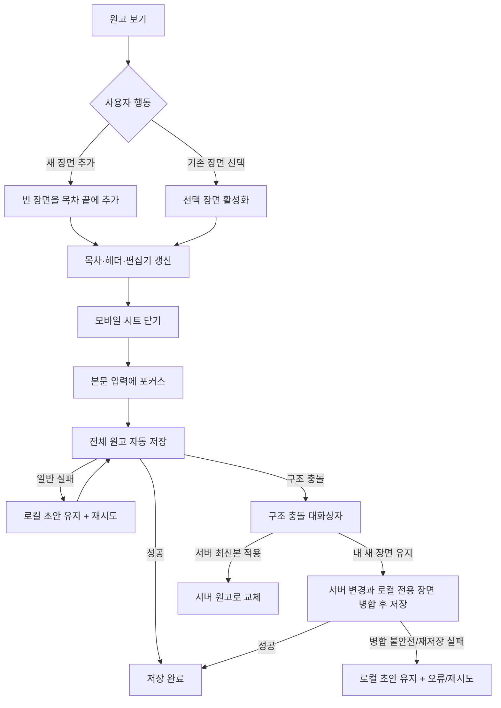

# 원고 장면 추가 UI 계획

## 1. Summary

집필 워크스페이스의 비활성 `새 장면 추가` 버튼을 활성화한다. 한 번 누르면 다음 장 번호와
`제목 없는 장면` 제목을 가진 빈 장면이 원고 목차 끝에 생기고 즉시 활성화되어 본문 입력에
포커스된다. 기존 전체 원고 자동 저장과 충돌 복구 흐름을 재사용한다.

## 2. Context and Goals

- **대상 사용자:** 기존 프로젝트의 원고를 이어 쓰는 작가
- **문제:** 현재 목차는 첫 장면을 읽기 전용으로 보여 주며 새 집필 단위를 만들거나 장면 사이를
  이동할 수 없다.
- **목표 결과:** 장면을 즉시 추가하고 기존·신규 장면 사이를 이동하면서 자동 저장 상태를
  일관되게 이해한다.
- **주 작업:** `원고 보기`에서 새 장면을 추가하고 빈 편집기에 바로 입력한다.

## 3. Scope and Exclusions

### Scope

- 기존 목차의 장면 추가 및 선택
- 활성 장면의 목차, 헤더, 편집기 동기화
- 추가 성공 알림과 편집기 포커스
- 자동 저장 실패 재시도와 구조 충돌 선택지
- 모바일 목차 시트 닫힘과 데스크톱 인라인 목차 유지

### Exclusions

- 제목 변경, 재정렬, 삭제
- 부 또는 중첩 목차
- 새 API 작업
- 집필 워크스페이스의 전반적인 재설계

## 4. Requirements

| ID | Requirement |
| --- | --- |
| REQ-SCENE-01 | `새 장면 추가` 한 번에 장면 하나를 즉시 생성한다. |
| REQ-SCENE-02 | 새 장면은 최댓값 다음 장 번호, `제목 없는 장면`, 빈 본문으로 목차 끝에 나타난다. |
| REQ-SCENE-03 | 새 장면이 즉시 활성화되고 편집기에 포커스된다. |
| REQ-SCENE-04 | 기존 장면을 선택해 다시 편집할 수 있다. |
| REQ-SCENE-05 | 목차, 헤더, 편집기는 같은 활성 장면 번호와 제목을 표시한다. |
| REQ-SCENE-06 | 추가와 선택은 기존 전체 원고 자동 저장 상태를 사용한다. |
| REQ-SCENE-07 | 저장 실패 시 로컬 장면을 보존하고 재시도 수단을 제공한다. |
| REQ-SCENE-08 | 구조 충돌 시 로컬 추가 장면 유지 또는 서버 최신본 적용을 선택한다. |
| REQ-SCENE-09 | 키보드, 포커스, 상태 알림과 모바일 전환을 지원한다. |

## 5. Confirmed Decisions

- 별도 제목 입력 없이 즉시 생성한다.
- 기본 제목은 `제목 없는 장면`이다.
- 장 번호는 기존 최댓값 + 1이다.
- 새 장면은 목차 끝에 추가되고 활성 장면이 된다.
- 저장은 기존 `saveManuscript` 전체 원고 작업을 사용한다.
- 이름 변경, 순서 변경, 삭제는 제외한다.

## 6. Assumptions and Rationale

- 현재 원고에는 도메인 불변 조건상 활성 장면이 항상 존재한다.
- 장면 ID는 UI에 노출되지 않으며 애플리케이션 계층에서 고유하게 만든다.
- 저장 대기 중 장면 선택은 로컬 초안을 없애지 않으므로 허용한다.
- 충돌 상태의 추가는 구조 변경 누적을 피하기 위해 비활성화한다.

## 7. Open Questions

Not applicable. 제품 동작과 범위는 승인된 설계에서 확정되었다.

## 8. Information Architecture

| State/Surface | Entry | Content | Actions | Requirements |
| --- | --- | --- | --- | --- |
| 데스크톱 원고 패널 | `원고 보기` 탭 | 목차 제목, 추가 버튼, 장면 목록 | 추가, 장면 선택 | 01–06, 09 |
| 모바일 원고 시트 | 모바일에서 `원고 보기` | 데스크톱과 같은 목차 | 추가/선택 후 시트 닫힘 | 01–06, 09 |
| 활성 장면 편집기 | 작업공간 로드 또는 장면 선택 | 장 번호, 제목, 본문 | 본문 입력 | 03–07, 09 |
| 자동 저장 표시 | 초안 변경 | 편집/저장/완료/오류/충돌 | 재시도, 충돌 열기 | 06–08 |
| 구조 충돌 대화상자 | 새 장면 저장의 409 | 충돌 설명과 두 선택 | 로컬 장면 유지, 서버 적용 | 08–09 |

목차는 보조 탐색 영역이고 편집기는 주 작업 영역이다. 선택 상태는 Manuscript의
`activeSceneId`가 단일 진실 공급원이다.

## 9. User Flow



## 10. Wireframes

### Desktop

```text
┌ 원고 목차 ──────────── [ + 새 장면 추가 ] ┐ ┌ Chapter 02 ───────────┐
│ 1장 비가 그친 뒤의 정원                   │ │ 제목 없는 장면          │
│▶2장 제목 없는 장면  (현재 장면)           │ │ [원고 본문           ] │
└──────────────────────────────────────────┘ └────────────────────────┘
                       상단: 2장 · 제목 없는 장면     저장 중… / 저장 완료
```

### Mobile

```text
[원고 보기] → ┌ 원고 보기 시트 ─────────────┐
              │ 원고 목차        [ + ]      │
              │ 1장 비가 그친 뒤의 정원     │
              │▶2장 제목 없는 장면          │
              └─────────────────────────────┘

추가/선택 → 시트 닫힘 → [2장 · 제목 없는 장면 / 빈 원고 본문(포커스)]
```

### Structural conflict

```text
┌ 원고 저장 충돌 해결 ───────────────────────┐
│ 서버 최신 원고에 아직 없는 새 장면이 있어요. │
│ 현재 로컬 초안은 보관하고 있습니다.           │
│ [서버 최신본 적용] [내 새 장면 유지]          │
└────────────────────────────────────────────┘
```

## 11. Responsive Behavior

- `<768px`: 목차는 기존 왼쪽 Sheet에 표시한다. 추가 또는 선택 성공 후 Sheet를 닫고 본문으로
  포커스를 이동한다.
- `>=768px`: 목차는 인라인 패널에 남고 편집기만 갱신한다.
- `>=1280px`: 기존 리사이즈 가능 패널 구조를 유지한다.
- 추가 버튼과 장면 행의 터치·키보드 대상은 기존 Button 및 전체 행 버튼 영역을 사용한다.

## 12. UI States

| State | Add control | Scene list/editor | Feedback |
| --- | --- | --- | --- |
| 기본/저장 완료 | 활성 | 현재 장면 표시 | 기존 저장 완료 표시 |
| 추가 직후/편집 중 | 활성 | 새 활성 장면과 빈 본문 | live region 추가 알림 |
| 저장 중 | 활성 | 로컬 초안 유지 | 기존 저장 중 표시 |
| 저장 오류 | 활성 | 로컬 초안 유지 | 기존 오류와 저장 재시도 |
| 충돌 비교/해결 | 비활성 | 로컬 초안 유지 | 충돌 대화상자 |
| 병합 실패 | 비활성 | 로컬 초안 유지 | alert와 재시도 |
| 로딩 | 화면 기존 skeleton | 조작 없음 | 기존 로딩 상태 |
| 잘못된 활성 장면 | 조작 없음 | 기존 파괴적 Alert | 기존 오류 상태 |

별도 폼이 없으므로 검증 오류나 일반적인 빈 상태는 적용되지 않는다.

## 13. Accessibility

- 추가 Button의 접근 가능한 이름은 `새 장면 추가`이다.
- 장면 버튼 이름은 `N장 <제목>`을 포함하고 활성 항목은 `aria-current="true"`를 가진다.
- 추가와 선택은 기본 Button 키보드 동작(Enter/Space)을 사용한다.
- 추가 성공은 `role="status" aria-live="polite"`로 한 번 알린다.
- React 렌더 뒤 본문 Textarea에 프로그래밍 방식으로 포커스를 이동한다.
- 활성 상태는 배경색뿐 아니라 `aria-current`와 텍스트/아이콘 스타일로 구분한다.
- 오류는 `role="alert"`, 해결 동작은 명시적 Button 이름을 사용한다.
- 충돌 Dialog의 기존 포커스 트랩과 닫은 뒤 포커스 복원을 유지한다.

## 14. shadcn/ui Status and Adoption Assumptions

저장소에는 shadcn/ui 기반 `Button`, `Sheet`, `Dialog`, `ScrollArea`, `Textarea`가 이미 있다.
새 primitive나 의존성은 필요하지 않다. `SceneTree`와 충돌 내용은 기존 primitive를 조합하는
제품 구성이다. 채택 후보는 없다.

## 15. Component Structure

| Unit | Responsibility | Data/state | Events |
| --- | --- | --- | --- |
| `WritingWorkspacePage` | 초안·반응형 패널·포커스 조정 | draft, autosave status, refs | add/select 요청 조정 |
| `ContextPanelContent` | 원고 패널에 콜백 전달 | manuscript, disabled | add/select 전달 |
| `SceneTree` | 목차 렌더링과 활성 표시 | manuscript, disabled | `onAdd`, `onSelect(sceneId)` |
| `ManuscriptEditor` | 활성 본문 편집과 포커스 대상 | scene, textarea ref | content/selection change |
| Manuscript domain | 추가·선택 불변 연산 | Manuscript, scene ID | 새 Manuscript 반환 |
| autosave hook | 전체 원고 저장과 구조 충돌 상태 | base/local/server manuscripts | retry/keep local/apply server |
| `ManuscriptConflictDialog` | 본문/구조 충돌 설명과 선택 | conflict kind, progress/errors | keep local/apply server/retry |

## 16. Requirement Traceability Matrix

| Requirement | IA/Flow | Wireframe/State | Components |
| --- | --- | --- | --- |
| 01–02 | 원고 패널, add flow | desktop/mobile default | SceneTree, domain |
| 03 | editor activation | post-add | Page, Editor |
| 04–05 | select flow | active row/editor | SceneTree, Page |
| 06–07 | autosave flow | saving/error | autosave, indicator |
| 08 | conflict flow | structural dialog | autosave, conflict dialog |
| 09 | mobile transition | mobile/focus/live | Page, Sheet, Editor |

## 17. Implementation Considerations

- ID 생성기를 순수 도메인에 넣지 않는다.
- 장 번호는 배열 길이가 아니라 현재 최댓값에서 계산한다.
- 추가/선택 시 함수형 초안 갱신을 사용해 저장 중 최신 초안을 덮어쓰지 않는다.
- 구조 충돌은 마지막 승인본과 로컬/서버 최신본을 비교하며, ID나 장 번호가 충돌하면 자동
  병합하지 않는다.
- 현재 헤더의 고정 `제1장` 문구를 활성 장면 번호로 바꾼다.
- 기존 OpenAPI 작업과 스키마가 복수 장면을 지원하므로 계약 편집은 하지 않는다.

## 18. Self-review Results

- 모든 요구사항은 IA, 흐름, 상태와 구성 요소에 매핑되었다.
- 데스크톱, 모바일, 저장 오류, 구조 충돌과 복구가 포함되었다.
- 모든 조작 요소의 이름, 키보드 동작, 포커스와 상태 알림을 정의했다.
- 현재 제공되는 shadcn/ui primitive와 제품 구성을 구분했다.
- 미확정 제품 규칙, 새 API 형태 또는 범위 밖 편집 기능을 추가하지 않았다.
- 이 문서는 승인된 설계와 일치하며 구현 코드를 포함하지 않는다.
