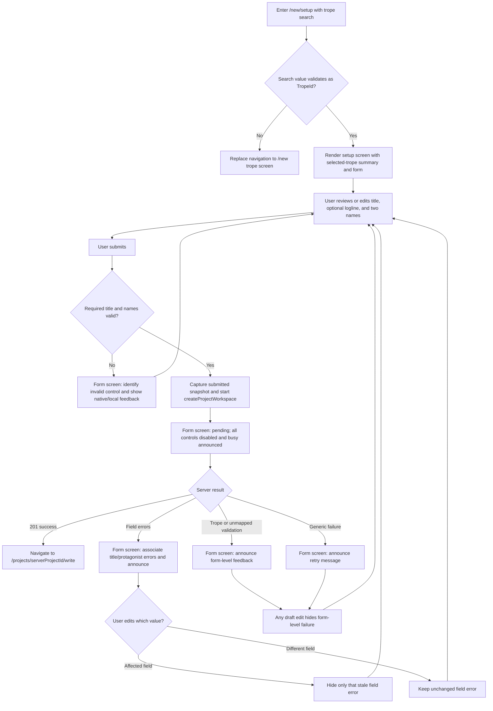

# Project Setup Page Boundary UI Plan

## 1. Summary

This document is the UI review baseline for the project setup screen at `/new/setup`. It preserves the current desktop and mobile layout and styling while moving workflow ownership out of the page, correcting contract alignment, and making validation feedback accessible.

The representative valid route is `/new/setup?trope=reunion`. Every search value accepted as `trope` must first be validated as the Story Design domain's `TropeId`. The screen consumes `createProjectWorkspace` from `docs/api/openapi.yaml` at approved blob `69d64146d62ab12b7462839a1f3ef0f76133374d`.

## 2. Context and Goals

**Target user:** A romance author who selected a registered trope in New Story step 1 and now needs to provide the minimum information required to create a writing workspace.

**Problem:** The current setup page owns route handling, form draft state, transport concerns, mutation state, navigation, and detailed form presentation. It also clears unrelated server errors on any edit, treats the logline as required, uses title guidance that contradicts the required-title rule, and does not semantically group the two protagonists.

**Desired outcome:** The user sees the same familiar setup screen, can submit contract-valid project details, receives stable and accessible feedback, and reaches the workspace identified by the successful server response. The page remains a thin route-aware composition unit.

**Primary task:** Review the selected trope, enter a required title, an optional logline, and two required protagonist names, then create and open the writing workspace.

## 3. Scope and Exclusions

### In scope

- The single setup screen at `/new/setup` and invalid-search recovery to `/new`.
- The existing header, selected-trope summary, setup form, pending state, validation feedback, transport-failure feedback, and successful workspace navigation.
- Ownership boundaries among the page, create-project feature, and form presentation.
- Desktop, mobile, accessibility, and shadcn/ui implementation guidance without a visual redesign.

### Exclusions

- Redesigning, restyling, or reordering the current screen.
- Changing the trope-selection screen, writing workspace, backend, domain contracts, or OpenAPI contract.
- Adding overlays, new routes, new dependencies, or new shadcn/ui components.
- Defining backend authorization, persistence, or error behavior beyond the approved contract.
- Refactoring the temporary writing-workspace page-boundary exception.

## 4. Requirements

- **REQ-01 — Validated route input:** The route accepts a `trope` search value only after validation as an authoritative Story Design `TropeId`. `/new/setup?trope=reunion` is a valid example. A missing or unregistered value redirects with replacement to `/new`; no string-to-domain assertion is a validation boundary.
- **REQ-02 — Preserved visual scope:** Preserve the current desktop/mobile layout, styling, content hierarchy, spacing, cards, colors, icons, and responsive breakpoints. Copy and semantics may change only where required for contract alignment or accessibility.
- **REQ-03 — Page responsibility:** The page owns the route guard, selected-trope summary composition, composition of the create-project feature, and navigation after success. It does not own form draft state, request construction, mutation/error translation, or detailed form markup.
- **REQ-04 — Feature responsibility:** The create-project feature owns one cohesive setup draft, the submitted-value snapshot, the create mutation, request construction, transport-error projection, and the form presentation contract exposed to the page.
- **REQ-05 — Form fields:** The form owns presentation and interaction for a required title, optional logline, exactly two required protagonist names, pending state, field feedback, and form feedback. Existing initial values remain: selected trope starter logline, first protagonist `서윤`, and second protagonist `도현`; title starts blank.
- **REQ-06 — Contract-aligned validation and copy:** A title containing only whitespace is invalid. Both protagonist names are trimmed and must remain non-empty. The logline is trimmed but may be blank; it must not have `required` semantics. Title guidance must not claim that an empty title is accepted. Use the neutral placeholder `작품 제목을 입력해 주세요`. Keep the visible logline label `한 줄 아이디어`; represent optionality through absence of required semantics and blank-submission coverage, without new copy.
- **REQ-07 — Pending and duplicate submission:** While creation is pending, all inputs and the submit button are disabled, the form exposes its busy state, the button label remains `작업 공간 여는 중`, and duplicate submission is prevented.
- **REQ-08 — Submitted-snapshot error lifetime:** A server field error remains visible while the corresponding value matches the submitted snapshot. Editing that field hides only its stale field error. Editing title must not hide an unchanged protagonist error. A new submission replaces the submitted snapshot and projected result. A form-level failure may be hidden after any draft edit because it is not attached to one field.
- **REQ-09 — Error projection:** Contract-declared title feedback maps to the title control; protagonist feedback maps to both protagonist controls; trope feedback and failures without a matching editable field appear as form-level feedback. Generic transport/server failure uses the existing retry message. Field and form feedback rendered asynchronously is announced.
- **REQ-10 — Protagonist semantics:** The protagonist controls are enclosed by a `fieldset` with the visible `legend` `두 주인공`. Each input retains its individual label. Shared protagonist feedback is associated with both inputs, and each affected input exposes invalid state.
- **REQ-11 — Navigation:** `트로프 다시 선택` returns to `/new`. Successful creation navigates to `/projects/{server-returned-projectId}/write`; the client must not derive or substitute the project identifier.
- **REQ-12 — Responsive behavior:** Responsive behavior is unchanged: the main content stacks on smaller viewports and becomes the existing `0.8fr / 1.2fr` two-column grid at the `lg` breakpoint; protagonist inputs stack by default and become two columns from `sm`; established paddings and vertical rhythm remain.
- **REQ-13 — Component dependency boundary:** Reuse the installed shadcn/ui `Badge`, `Button`, `Card`, `Input`, `Label`, and `Textarea`. Adoption candidates: none.
- **REQ-14 — Approved API baseline:** The form submits through `createProjectWorkspace` as defined by approved OpenAPI blob `69d64146d62ab12b7462839a1f3ef0f76133374d`. This plan does not alter its request, success, or error contract.

## 5. Confirmed Decisions

- The setup experience remains one route and one screen; there are no overlays.
- The visible layout and styling remain unchanged on desktop and mobile.
- The page keeps route validation, invalid-search redirection, selected-trope summary composition, and success navigation only.
- The create-project feature owns draft, submitted snapshot, mutation, request construction, error projection, and detailed form presentation.
- A cohesive typed draft is used without a reducer; TanStack Query continues to own mutation lifecycle state.
- Logline is optional and may be submitted as a blank string. Title and both protagonist names remain required after trimming.
- The visible logline label remains `한 줄 아이디어`; no optional indicator or other new logline copy is added.
- Field feedback is tied to the submitted snapshot rather than reset globally on any edit.
- The protagonists use `fieldset`/`legend`, shared descriptions, invalid state, and async announcements.
- The six existing shadcn/ui primitives are reused. No adoption candidate or dependency is introduced.

## 6. Assumptions and Rationale

- **A-01:** Existing Korean screen copy not contradicted by the contracts remains unchanged. This minimizes visible change and follows the approved behavior-preserving refactor.
- **A-02:** The title placeholder becomes `작품 제목을 입력해 주세요` because it agrees with the required-title rule and approved 422 example while fitting the current input position. It does not introduce a stricter rule.
- **A-04:** No separate initial loading or empty-result screen is needed because registered trope templates are synchronous repository-owned data and the form itself is the initial state. Mutation pending is the applicable loading state.
- **A-05:** Async error feedback is announced in place without automatically moving focus. This preserves the current interaction layout while ensuring screen-reader notification; the user can navigate to the associated control using normal keyboard order.

## 7. Open Questions

None. The approved design, domain contracts, and OpenAPI baseline resolve all screen-planning decisions required for this task.

## 8. Information Architecture

| Screen or state                    | Purpose and entry                                | Primary content and hierarchy                                                                            | Actions and navigation                                                                     | Requirements                         |
| ---------------------------------- | ------------------------------------------------ | -------------------------------------------------------------------------------------------------------- | ------------------------------------------------------------------------------------------ | ------------------------------------ |
| Setup screen — default             | Enter from trope selection or a direct valid URL | Header with brand and back action; left/top introduction and selected-trope card; right/below setup form | Edit fields; return to `/new`; submit                                                      | REQ-01–REQ-06, REQ-10, REQ-12–REQ-14 |
| Setup screen — pending             | Valid form submission                            | Same structure; controls disabled; form busy; progress conveyed by button label                          | Duplicate submit blocked; await result                                                     | REQ-07                               |
| Setup screen — field/form feedback | Client-required validation or failed mutation    | Same form with associated field messages and/or one form-level alert                                     | Correct affected value and resubmit; unrelated errors remain until their own values change | REQ-06, REQ-08–REQ-10                |
| Invalid route recovery             | Missing or unregistered `trope` search value     | No setup content is committed as a valid screen                                                          | Replacement redirect to `/new`                                                             | REQ-01                               |
| Successful handoff                 | `createProjectWorkspace` returns a workspace     | Setup screen exits; destination owns its own presentation                                                | Navigate to returned project workspace route                                               | REQ-11, REQ-14                       |

There is no distinct overlay or empty collection state. The blank title in the default form is an editable field state, not an empty screen.

## 9. User Flow



The header's `트로프 다시 선택` action is available from each rendered setup state and navigates to `/new`.

## 10. Wireframes

### Desktop (`lg` and wider)

```text
┌──────────────────────────────────────────────────────────────────────────────┐
│ [BrandMark]                                      [← 트로프 다시 선택]       │
├──────────────────────────────────────────────────────────────────────────────┤
│                                                                              │
│  NEW STORY · STEP 2                 ┌─────────────────────────────────────┐  │
│  이야기의 첫 문장을 준비할게요      │ 새 프로젝트 설정 (form)            │  │
│  Supporting paragraph               │                                     │  │
│                                     │ 작품 제목                           │  │
│  ┌ Selected trope Card ──────────┐  │ [작품 제목을 입력해 주세요       ] │  │
│  │ ♥ 선택한 트로프              │  │ [associated title feedback]         │  │
│  │   재회 로맨스                 │  │                                     │  │
│  │ [과거] [오해] [두 번째 기회] │  │ 한 줄 아이디어                       │  │
│  └───────────────────────────────┘  │ [starter logline textarea          ] │  │
│                                     │ [associated starter-logline help]   │  │
│                                     │                                     │  │
│                                     │ ┌─ 두 주인공 (fieldset/legend) ──┐ │  │
│                                     │ │ 첫 번째       두 번째           │ │  │
│                                     │ │ [서윤       ] [도현           ] │ │  │
│                                     │ │ [shared announced feedback]      │ │  │
│                                     │ └─────────────────────────────────┘ │  │
│                                     │ [announced form-level feedback]     │  │
│                                     │ [ 작업 공간 열기                 →] │  │
│                                     └─────────────────────────────────────┘  │
└──────────────────────────────────────────────────────────────────────────────┘
```

- The summary remains the narrower left column; the form card remains the wider right column.
- Tab order follows document order: header back action, title, logline, first protagonist, second protagonist, submit.
- On pending, fields and submit retain their positions and become disabled; the submit text changes to `작업 공간 여는 중`.
- In-place feedback expands the relevant field group or the area above submit; no overlay or focus trap is introduced.

### Mobile and tablet (below `lg`)

```text
┌──────────────────────────────────┐
│ [BrandMark] [← 트로프 다시 선택]│
├──────────────────────────────────┤
│ NEW STORY · STEP 2               │
│ 이야기의 첫 문장을 준비할게요    │
│ Supporting paragraph             │
│ ┌ Selected trope Card ─────────┐ │
│ │ ♥ 재회 로맨스                │ │
│ │ [과거] [오해] [...]          │ │
│ └───────────────────────────────┘ │
│                                  │
│ ┌ Setup form Card ─────────────┐ │
│ │ 작품 제목                    │ │
│ │ [                          ] │ │
│ │ [field feedback]             │ │
│ │                              │ │
│ │ 한 줄 아이디어              │ │
│ │ [                          ] │ │
│ │ [                          ] │ │
│ │ [help]                       │ │
│ │                              │ │
│ │ 두 주인공                    │ │
│ │ 첫 번째 [서윤              ] │ │
│ │ 두 번째 [도현              ] │ │
│ │ [shared feedback]            │ │
│ │ [form feedback]              │ │
│ │ [ 작업 공간 열기          →] │ │
│ └──────────────────────────────┘ │
└──────────────────────────────────┘
```

- The introduction, summary, and form stack in the current order.
- Protagonist fields stack below `sm`; from `sm` they share one row even while the overall screen remains single-column below `lg`.
- Full-width form controls and submit action are preserved.

## 11. Responsive Behavior

- Keep the existing centered maximum widths, header height, border, and horizontal padding (`px-6`, increasing to `lg:px-10`).
- Keep main vertical padding (`py-12`, increasing to `lg:py-16`) and the current `gap-10` between introductory and form content.
- Below `lg`, render the intro/summary before the form. At `lg`, use the current `lg:grid-cols-[0.8fr_1.2fr]`, with the current top offset on the left summary column.
- Keep the form card's current compact mobile padding and increased `sm` padding.
- Keep protagonist controls stacked by default and in `sm:grid-cols-2` from the small breakpoint.
- Error messages wrap within their owning column. They must not force horizontal scrolling or detach from the described control.
- No breakpoint, card dimension, typography scale, navigation placement, or visual hierarchy changes are introduced.

## 12. UI States

| State                  | Visible behavior                                                                                              | Interaction and feedback                                                                                                                                                                                                                                                                                                          |
| ---------------------- | ------------------------------------------------------------------------------------------------------------- | --------------------------------------------------------------------------------------------------------------------------------------------------------------------------------------------------------------------------------------------------------------------------------------------------------------------------------- |
| Default                | Empty required title; starter logline prefilled; protagonist defaults `서윤` and `도현`; selected trope shown | All controls enabled; submit available; title and names expose required semantics while logline has no required semantics or new optionality copy                                                                                                                                                                                 |
| Locally invalid        | Required title or either required name is empty under the form's required semantics                           | Submission does not start; invalid control is identified and receives invalid semantics; first invalid required control follows browser/form focus behavior. Whitespace-only values remain invalid under the domain contract and may be returned as associated server feedback; this plan does not reassign validation authority. |
| Pending/loading        | Layout unchanged; button says `작업 공간 여는 중`                                                             | Form is busy; all inputs and submit are disabled; duplicate submission blocked                                                                                                                                                                                                                                                    |
| Field validation error | Associated message appears below title or protagonist group                                                   | Message is announced; affected inputs have invalid state and description; error persists against unchanged submitted value                                                                                                                                                                                                        |
| Form validation error  | Trope/unmapped server validation message appears above submit                                                 | `role="alert"` or equivalent assertive announcement; any draft edit may hide it                                                                                                                                                                                                                                                   |
| Generic error          | Existing `프로젝트를 만들지 못했어요. 잠시 후 다시 시도해 주세요.` appears above submit                       | Announced as form-level feedback; controls re-enable; user may edit or resubmit                                                                                                                                                                                                                                                   |
| Correcting one field   | Only error whose submitted value changed is hidden                                                            | Unchanged field errors remain visible and associated                                                                                                                                                                                                                                                                              |
| Success                | No persistent success panel on setup screen                                                                   | Navigate to the workspace route using the server-returned project ID                                                                                                                                                                                                                                                              |
| Invalid/missing trope  | Setup screen is not treated as valid                                                                          | Replacement redirect to `/new`                                                                                                                                                                                                                                                                                                    |
| Empty screen           | Not applicable                                                                                                | This form has an editable blank-title state, not an empty collection state                                                                                                                                                                                                                                                        |

## 13. Accessibility

- Keep the form's accessible name `새 프로젝트 설정` and expose pending with `aria-busy="true"`.
- Associate `Label` with each `Input` and `Textarea` using stable `for`/`id` pairs.
- Mark title and both protagonist inputs required; do not mark the logline required. Keep its visible label `한 줄 아이디어` and existing starter-template help unchanged; optionality is represented by absent required semantics and verified blank submission, not added copy.
- Preserve the logline's associated starter-template help whether or not a server message exists. If multiple descriptions apply, reference all relevant IDs.
- Wrap both protagonist controls in a semantic `fieldset` whose visible `legend` is `두 주인공`; do not replace the legend with a plain paragraph.
- Associate shared protagonist feedback with both inputs using `aria-describedby`, and set `aria-invalid` on both when that shared error is active.
- Associate title feedback with the title input and set its invalid state. Do not use color alone; visible text accompanies destructive styling.
- Announce asynchronously inserted field and form feedback with an appropriate live region or alert semantic. Avoid duplicate announcements when the same shared protagonist message describes two inputs.
- Preserve visible keyboard focus styles provided by the installed primitives. All actions remain reachable in DOM order with no custom keyboard interaction.
- Do not move focus on a draft edit. After server feedback, preserve focus and announce the result; after success, destination-page focus behavior belongs to the destination route.
- Icons remain decorative where adjacent text supplies the accessible name; they do not replace labels.

## 14. shadcn/ui Status and Adoption Assumptions

shadcn/ui is configured (`frontend/components.json` and the `shadcn` package are present). Repository evidence confirms these required primitives are already installed under `frontend/src/components/ui/` and already imported by the setup page:

- `Badge` — selected trope tags.
- `Button` — back navigation composition and submit action.
- `Card` / `CardContent` — selected-trope summary and form surfaces.
- `Input` — title and protagonist fields, including existing invalid/disabled styles.
- `Label` — associated field labels.
- `Textarea` — logline that permits blank submission.

**Adoption candidates: none.** Semantic `form`, `fieldset`, `legend`, help/error text, and live-region attributes use native HTML around existing primitives. Existing `BrandMark` and Lucide icons remain established local elements; neither requires a new primitive.

## 15. Component Structure

| Layer / composition                                                             | Responsibility                                                                                                        | Required data                                                                                  | Owned local state                                                                                    | Emitted events                                                | UI basis                                                                             |
| ------------------------------------------------------------------------------- | --------------------------------------------------------------------------------------------------------------------- | ---------------------------------------------------------------------------------------------- | ---------------------------------------------------------------------------------------------------- | ------------------------------------------------------------- | ------------------------------------------------------------------------------------ |
| `SetupPage` (page)                                                              | Validate/guard route result, compose header and selected-trope summary with feature, navigate on successful creation  | Validated `TropeId`, matching trope template, server-returned project ID from success callback | No detailed draft or transport state                                                                 | Back navigation through link; success navigation to workspace | Native layout + existing `BrandMark`, `Button`, `Card`, `Badge`                      |
| `SelectedTropeSummary` (page-level product composition, inline or focused unit) | Present the selected registered trope without owning workflow                                                         | Trope title and tags                                                                           | None                                                                                                 | None                                                          | `Card`, `CardContent`, `Badge`, existing icon                                        |
| `CreateProjectSetup` (feature product composition)                              | Coordinate setup draft, submitted snapshot, mutation, error projection, and form props; expose typed success callback | Valid `TropeId`, starter logline, initial protagonist names                                    | Cohesive typed draft and submitted-value snapshot only; mutation lifecycle remains in TanStack Query | `onSuccess(projectId)`                                        | Composes `ProjectSetupForm`; no new primitive                                        |
| `ProjectSetupForm` (feature form presentation)                                  | Render detailed form, fields, semantic protagonist group, pending state, and field/form feedback                      | Draft values; pending flag; projected title/protagonist/form feedback                          | No duplicate transport or mutation state; ordinary input mechanics only if needed                    | Title/logline/name change events; submit event                | Native `form`, `fieldset`, `legend` + `Input`, `Textarea`, `Label`, `Button`         |
| Title field group                                                               | Present required project title and associated feedback                                                                | Title value, title error, pending                                                              | None                                                                                                 | `onTitleChange`                                               | `Label`, `Input`, native feedback text/live semantics                                |
| Logline field group                                                             | Present the starter logline and existing help while permitting blank submission                                       | Logline value, starter help, pending                                                           | None                                                                                                 | `onLoglineChange`                                             | `Label`, `Textarea`, native help text; no required semantics or new optionality copy |
| Protagonist fieldset                                                            | Present exactly two individually labeled required inputs and one shared error                                         | Two names, shared protagonist error, pending                                                   | None                                                                                                 | First/second name change events                               | Native `fieldset`/`legend`, `Label`, two `Input`s, native shared feedback            |
| Form feedback                                                                   | Announce trope/unmapped validation or generic failure                                                                 | Projected form message                                                                         | None                                                                                                 | None                                                          | Native `role="alert"` or equivalent live region                                      |
| Submit action                                                                   | Start one submission and convey pending                                                                               | Pending flag                                                                                   | None                                                                                                 | `onSubmit`                                                    | `Button`                                                                             |

The exact implementation names may follow the existing feature naming convention, but the responsibilities and interfaces above are the review boundary. No form component may independently read router state, and the page may not import infrastructure contracts or errors.

## 16. Requirement Traceability Matrix

| Requirement | IA / flow                                           | Wireframe or state                               | Component responsibility                        |
| ----------- | --------------------------------------------------- | ------------------------------------------------ | ----------------------------------------------- |
| REQ-01      | Invalid route recovery; validation decision in flow | Invalid/missing trope                            | `SetupPage`                                     |
| REQ-02      | Setup default                                       | Desktop and mobile structures                    | `SetupPage`, summary, form                      |
| REQ-03      | Setup default and success handoff                   | Both structures; success state                   | `SetupPage`                                     |
| REQ-04      | Submission through result branches                  | Pending/error/correction states                  | `CreateProjectSetup`                            |
| REQ-05      | Setup default                                       | All form controls                                | `ProjectSetupForm` and field groups             |
| REQ-06      | Local-validation decision                           | Default and locally invalid states               | Title, logline, protagonist groups              |
| REQ-07      | Pending branch                                      | Pending annotations/state                        | `CreateProjectSetup`, form, submit              |
| REQ-08      | Error correction branches                           | Field error and correcting-one-field states      | `CreateProjectSetup` snapshot projection        |
| REQ-09      | Server error branches                               | Field/form/generic error states                  | Feature projection, field groups, form feedback |
| REQ-10      | Setup and field-error paths                         | Protagonist group in both wireframes             | Protagonist fieldset                            |
| REQ-11      | Back action and success branch                      | Header and success state                         | `SetupPage`                                     |
| REQ-12      | Setup default                                       | Desktop/mobile wireframes and responsive section | Page and form layout compositions               |
| REQ-13      | All rendered setup states                           | Primitive annotations                            | All presentation compositions                   |
| REQ-14      | Mutation branch                                     | Pending, errors, and success                     | `CreateProjectSetup`                            |

## 17. Implementation Considerations

- Define and export the authoritative `TropeId` and a validation guard/parser through the Story Design public API, then type templates, route search, feature input, and transport contract from it. Do not cast an unvalidated search string.
- Keep replacement navigation for invalid/missing search recovery, matching the current canonicalization behavior. Normal back and success navigation remain user/workflow navigation.
- Preserve current request behavior while moving request construction and transport-error conversion behind a typed create-project feature interface. The page receives only success data needed for navigation.
- Model the draft as one cohesive typed value. Do not introduce a reducer merely to replace setters, and do not duplicate TanStack Query pending/error/success state.
- Capture the submitted snapshot at each submit. Project each field error only while its current field value equals the corresponding snapshot value. Treat the pair of protagonist names as the value for the shared `protagonistNames` error.
- Remove whole-mutation reset behavior from generic field-change handlers. A form-level feedback projection may become hidden after any edit without erasing unrelated field feedback.
- Ensure blank logline submission remains possible even though `logline` remains a required request property: submit the draft's string value, including an allowed blank string after normalization.
- Keep tests observable: valid/invalid route behavior, blank logline submission, required-title guidance, pending disablement and duplicate prevention, snapshot-scoped error lifetime, field descriptions/invalid state, fieldset/legend, async announcements, generic error, and server-returned navigation.
- No visual snapshots, new CSS system, dependency installation, OpenAPI edit, or domain-contract edit is implied by this plan.

## 18. Self-review Results

- **Traceability:** Pass. Every REQ-01 through REQ-14 maps to an IA state, flow step, wireframe/state, and component responsibility.
- **IA/flow consistency:** Pass. Every IA state appears in the Mermaid flow or has an explicit explanation; no overlay is introduced.
- **Wireframe coverage:** Pass. Desktop and mobile cover default structure, pending behavior, field/form feedback placement, and navigation actions.
- **Action/component coverage:** Pass. Back, field changes, submit, error feedback, and success navigation have named owners.
- **UI states:** Pass. Default, applicable loading/pending, local validation, field/form/generic errors, correction, disabled, success, invalid-route, and non-applicable empty state are addressed.
- **Responsive behavior:** Pass. Existing `sm` and `lg` transitions are preserved with no redesign.
- **Accessibility:** Pass. Labels, required/optional semantics, `fieldset`/`legend`, descriptions, invalid state, busy state, async announcements, focus behavior, and keyboard order are specified.
- **shadcn/ui accuracy:** Pass. `Badge`, `Button`, `Card`, `Input`, `Label`, and `Textarea` are evidenced as installed and reused; adoption candidates are explicitly none.
- **Decision hygiene:** Pass. Confirmed decisions, assumptions, and open questions are separated; no unsupported domain, API, authorization, security, or product policy is introduced.
- **Ownership:** Pass. This planning task changes only `frontend/docs/ui-plans/project-setup-page-boundary.md`.
