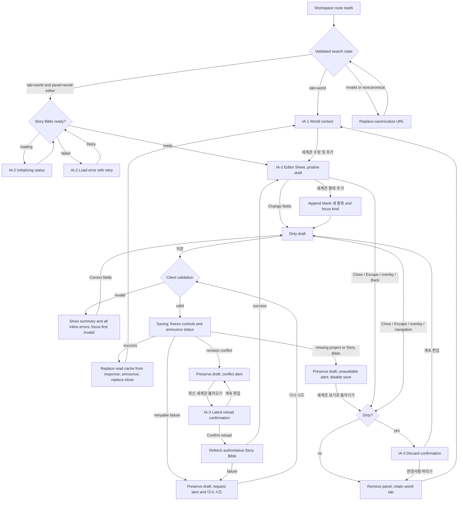

# Worldbuilding Edit and Add UI Plan

## 1. Summary

Add a focused worldbuilding editor to the existing writing workspace at
`/projects/$projectId/write`. From the `세계관 보기` context, a romance author
can open `세계관 수정 및 추가`, edit every existing world entry, append multiple
new entries, and explicitly save the complete draft as one operation. The
authoritative server response replaces the read-only list after a successful
save.

The editor is a right-side Sheet on desktop and a full-width Sheet on mobile.
Its visible state is owned by the canonical URL
`?tab=world&panel=world-editor`; field values, dirty state, validation results,
and discard-confirmation visibility remain local. The UI never offers delete,
reorder, silent overwrite, silent discard, partial save, or automatic conflict
merge.

This plan covers all approved requirements `REQ-WORLD-001` through
`REQ-WORLD-010`. Requirements `REQ-WORLD-008` and `REQ-WORLD-009` also require
backend behavior outside this screen plan; their user-visible conflict and
failure outcomes are specified here without inventing transport shapes.

## 2. Context and Goals

### Target user

A romance author who is actively drafting a scene and needs to correct or add
factual Story Bible world information without leaving the writing workspace.

### Current repository context

- The writing workspace has vertical `원고 보기`, `인물 보기`, and `세계관 보기`
  tabs. At widths below 768 px the selected context is displayed in a left
  Sheet; from 768 px it is inline, and from 1280 px the workspace uses resizable
  panels.
- `StoryContextPanel` currently renders compact, read-only world cards.
- The current branch still stores the selected context tab in local state. The
  approved workspace-tab URL design and implementation plan are prerequisites
  and must be integrated with this feature rather than duplicated.
- Story Bible owns world-entry identity, kind, title, and description. The
  frontend supplies early feedback, while the backend remains authoritative
  for validation, identifiers, revision checking, and persistence.

### User problem

The author can consult world facts while writing but must leave the flow or use
another mechanism to change them. This interrupts drafting and makes it easy
for manuscript prose and Story Bible facts to diverge.

### Desired outcome

The author can safely revise and extend the world list in place, understand
what will be saved, recover from validation, request, and revision-conflict
failures without losing work, and use the same flow on desktop, mobile, mouse,
touch, and keyboard.

### Primary task

Open the world editor, revise existing entries and/or append new entries, then
save the entire draft atomically.

## 3. Scope and Exclusions

### In scope

- Add an accessible `세계관 수정 및 추가` action to the world context heading,
  including the empty-list state.
- Edit `분류`, `제목`, and `설명` for all existing world entries.
- Append multiple unsaved world entries and distinguish them from existing
  entries without relying on color.
- Validate all draft rows, focus the first invalid field, and communicate field
  and request errors accessibly.
- Submit once through an explicit `저장` action; disable duplicate submission.
- Replace the read list from the authoritative save response and close on
  success.
- Preserve the draft through request failures and revision conflict; provide
  retry or latest-world recovery as appropriate.
- Confirm before discarding a dirty draft through close controls, Escape,
  overlay interaction, or browser navigation.
- Reconstruct the selected world tab and open editor from URL search state and
  support Back/Forward replay.
- Define desktop, tablet, and mobile layout and focus behavior.

### Excluded

- Delete, bulk delete, or reorder of world entries.
- Character, manuscript, project, or story-concept editing.
- Editing scene-context references.
- LLM-assisted generation, import, export, attachments, or content templates.
- Automatic merge, silent conflict retry, presence, or multi-user indicators.
- File-path, locking, serialization, atomic-replacement, or API-schema design.
  These belong to backend and OpenAPI work.
- General workspace redesign or changes to the AI tool and manuscript autosave
  flows.

## 4. Requirements

| ID | UI interpretation and acceptance signal |
| --- | --- |
| `REQ-WORLD-001` | The world panel heading has an accessible `세계관 수정 및 추가` button in populated and empty states. |
| `REQ-WORLD-002` | Opening the button shows one labeled editor section per existing entry, with editable kind, title, and description. |
| `REQ-WORLD-003` | `세계관 항목 추가` appends any number of blank `새 항목` sections and focuses the new kind field. |
| `REQ-WORLD-004` | Save validates trimmed title and description as non-empty, exposes all invalid fields, and does not let the author edit identifiers. The UI submits existing identities and treats returned addition identities as authoritative. |
| `REQ-WORLD-005` | Success replaces the visible list from the response, announces success, and closes the Sheet. Failure preserves every draft value, explains the outcome, and exposes the appropriate retry or recovery action. |
| `REQ-WORLD-006` | Every attempted close of a dirty editor opens a discard confirmation; an unchanged editor closes immediately. Cancel returns to the editor without draft loss. |
| `REQ-WORLD-007` | `tab=world&panel=world-editor` reconstructs the open editor. Explicit open/close writes history; Back/Forward replays state. Invalid state is replacement-canonicalized. |
| `REQ-WORLD-008` | A stale-revision result is presented as a conflict that preserves the draft and offers `최신 세계관 불러오기`; the UI never offers overwrite. File persistence itself is backend-owned. |
| `REQ-WORLD-009` | The UI reports only authoritative success or a preserved-draft failure and never presents partial success. Atomic file replacement is backend-owned. |
| `REQ-WORLD-010` | Desktop and mobile expose equivalent edit, add, save, conflict, retry, and discard flows with keyboard operation, visible focus, explicit labels, and announced errors/status. |

## 5. Confirmed Decisions

- The target is the existing `/projects/$projectId/write` screen and its
  `세계관 보기` context, not a new route.
- The launch label and Sheet title are exactly `세계관 수정 및 추가`.
- The editor uses a Sheet: right-side and bounded on desktop, full width on
  small screens.
- World kinds use the domain values `place`, `object`, and `rule`, displayed as
  `장소`, `사물`, and `규칙`.
- Existing entries and additions are submitted as one explicit command. No row
  is saved independently.
- Titles and descriptions are trimmed for validation and authoritative save;
  blank normalized values are rejected.
- Existing identifiers are preserved and never editable. Addition identifiers
  come only from the server response.
- A revision conflict preserves the draft and offers latest-world reload after
  discard confirmation. There is no merge or force-save action.
- The canonical open state contains both `tab=world` and
  `panel=world-editor`. User open and explicit close create history entries.
- Closing a dirty editor requires confirmation for the close button, Escape,
  overlay interaction, and browser navigation.
- Desktop and mobile provide the same workflow. Delete and reorder controls do
  not appear.
- The backend persists project-scoped Story Bible JSON files and owns revision
  and atomic replacement behavior; the UI does not expose file-system details.

## 6. Assumptions and Rationale

1. **Read cards expose kind text.** Each compact world card gains a small
   `장소`, `사물`, or `규칙` badge alongside its title. This makes a changed kind
   observable after save and does not rely on color or icon interpretation.
2. **Editor width is content-led.** Use full viewport width below `sm`, then a
   right Sheet around 40rem wide (`sm:max-w-2xl`) while respecting the existing
   `100svh` surface. This fits the stacked form without obscuring the entire
   desktop workspace.
3. **Canonical recovery preserves editor intent.** A URL containing
   `panel=world-editor` without `tab=world` replacement-canonicalizes to include
   `tab=world`; an unsupported `panel` is removed while other valid search
   values are preserved. This yields the one approved open-editor URL.
4. **Successful save closes with replacement navigation.** Save success is a
   system response to the persistence command, not an explicit close
   navigation, so it removes `panel` with replacement. Back does not reopen a
   just-saved editor. The explicit close button, Escape, overlay-confirmed
   close, and confirmed discard remove `panel` with a new history entry.
5. **Direct-link close has a focus fallback.** If the launch button is mounted,
   focus returns to it. On a mobile direct link where the underlying transient
   context Sheet is not open, focus returns to the `세계관 보기` tab.
6. **Pending save freezes the submitted draft.** During save, kind/title/
   description fields, add, save, and close affordances are disabled. This
   avoids a visible draft diverging from the in-flight atomic command. They are
   restored on failure.
7. **Native selection is sufficient in scope.** The kind field uses a styled
   native `<select>` so no new primitive or dependency is required. A generated
   shadcn/ui Select is an optional adoption candidate, not a prerequisite.
8. **Dirty comparison uses the raw editable draft.** Any field change or added
   row makes the editor dirty, including whitespace-only edits, until a
   successful save or confirmed reset. This favors protection over surprising
   discard.

## 7. Open Questions

None. The approved design and assigned brief resolve every question that could
change the domain meaning, primary flow, data needs, privacy, or API semantics.
The presentation assumptions above are narrow and do not alter those contracts.

## 8. Information Architecture

### IA-1 — Writing workspace: world context

- **Purpose:** Consult the authoritative world list and enter editing.
- **Entry:** Select `세계관 보기`, navigate directly to `?tab=world`, close the
  editor after save/discard, or navigate Back from the open editor.
- **Hierarchy:** Workspace header → domain tab rail → world context heading and
  edit action → world cards or empty state → manuscript editor remains primary
  workspace content.
- **Content:** `세계관` heading; `세계관 수정 및 추가`; compact cards with kind,
  title, and description; or `아직 등록된 세계관 항목이 없어요.`
- **Actions:** Open editor. Existing cards are not individually actionable.
- **Navigation:** Open writes `tab=world&panel=world-editor`. On mobile, the
  world context itself remains the existing transient left Sheet when entered
  through the tab rail.
- **Requirements:** `REQ-WORLD-001`, `REQ-WORLD-005`, `REQ-WORLD-007`,
  `REQ-WORLD-010`.

### IA-2 — World editor Sheet

- **Purpose:** Edit the complete world-entry draft and submit it once.
- **Entry:** IA-1 action or direct canonical editor URL.
- **Hierarchy:** Fixed Sheet header → request/validation feedback → scrollable
  entry form → add action → fixed Sheet footer.
- **Content:** Title, short description, existing-entry sections, new-entry
  sections, kind/title/description controls, error summary and field errors.
- **Actions:** Change fields, add a row, retry a retryable save, request latest
  world after conflict, save, or attempt close.
- **Navigation:** Clean close removes `panel` and retains `tab=world`; success
  does the same with replacement. Dirty close routes through IA-3.
- **Requirements:** `REQ-WORLD-002`, `REQ-WORLD-003`, `REQ-WORLD-004`,
  `REQ-WORLD-005`, `REQ-WORLD-007`, `REQ-WORLD-010`.

### IA-3 — Discard confirmation Dialog

- **Purpose:** Prevent loss when a dirty draft would be replaced or abandoned.
- **Entry:** Dirty Sheet close, Escape, overlay interaction, browser navigation,
  or `최신 세계관 불러오기` after conflict.
- **Hierarchy:** Title → consequence-specific description → safe cancel →
  destructive confirmation.
- **Content:** For close/navigation, `저장하지 않은 변경사항을 버릴까요?`; for
  latest reload, `현재 편집 내용을 버리고 최신 세계관을 불러올까요?`.
- **Actions:** `계속 편집` and either `변경사항 버리기` or `최신 세계관 불러오기`.
- **Navigation:** Cancel preserves the editor URL and draft. Confirm either
  resumes the requested navigation/close or refetches and replaces the draft.
- **Requirements:** `REQ-WORLD-005`, `REQ-WORLD-006`, `REQ-WORLD-007`,
  `REQ-WORLD-008`, `REQ-WORLD-010`.

### Meaningful state inventory

- World read loading, ready/populated, ready/empty, fetch error, and unavailable.
- Editor initializing, pristine, dirty, invalid, saving, retryable save error,
  revision conflict, unavailable data, and save success transition.
- Discard confirmation for close/navigation and for latest reload.

## 9. User Flow



Back and Forward use the same validated URL path as direct entry. Back from a
dirty editor pauses at IA-3; confirming resumes the intended history
navigation, while cancelling leaves the current history location and draft
visible. Forward into the canonical editor URL creates a fresh draft from the
current authoritative query value, never from discarded local values.

## 10. Wireframes

### Desktop — populated world context (`>= 768 px`)

```text
┌───────────────────────────────────────────────────────────────────────────┐
│ ←  Muse · Project title                                      자동 저장됨 │
├────┬───────────────────────┬──────────────────────────────────────────────┤
│tabs│ 세계관              [세계관 수정 및 추가]                           │
│    │                       │                                              │
│    │ [장소] 비가 그친 온실 │                Manuscript editor             │
│    │ 두 사람이 과거에…     │                                              │
│    │                       │                                              │
│    │ [규칙] 왕실의 서약     │                                              │
│    │ 서약을 어기면…         │                                              │
└────┴───────────────────────┴──────────────────────────────────────────────┘
```

`세계관 수정 및 추가` is a compact outline Button aligned with the heading.
At narrow inline-panel widths it wraps below the heading rather than truncating
the accessible label. Cards retain compact hierarchy and add a textual kind
Badge so saved kind changes are visible without color.

### Desktop — editor Sheet, default/dirty

```text
┌──────── workspace remains visible under overlay ────────┬────────────────┐
│                                                          │ 세계관 수정 및 │
│                                                          │ 추가       [×]│
│                                                          │ 기존 항목을…  │
│                                                          ├────────────────┤
│                                                          │ (feedback slot)│
│                                                          │ ┌ 기존 항목 1 ┐│
│                                                          │ │분류 [장소 ▼]││
│                                                          │ │제목 [온실  ]││
│                                                          │ │설명         ││
│                                                          │ │[두 사람이…] ││
│                                                          │ └─────────────┘│
│                                                          │ ┌ 새 항목 1  ┐│
│                                                          │ │분류 [규칙 ▼]││
│                                                          │ │제목 [      ]││
│                                                          │ │설명 [      ]││
│                                                          │ └─────────────┘│
│                                                          │[+ 세계관 항목 │
│                                                          │          추가]│
│                                                          ├────────────────┤
│                                                          │ [취소] [저장] │
└──────────────────────────────────────────────────────────┴────────────────┘
```

- The Sheet header and footer do not scroll; entry sections scroll between
  them. `취소` follows the same dirty-close rules as `[×]`.
- Each section has a visible `기존 항목 N` or `새 항목 N` Badge/legend. Identity
  values are not shown as editable fields.
- Desktop fields use kind and title in a two-column row, with description full
  width beneath. Long Korean text wraps; no horizontal scroll is introduced.

### Mobile — world context and full-width editor (`< 640 px`)

```text
Context Sheet                         Editor Sheet layered above context
┌──────────────────────────┐          ┌──────────────────────────┐
│ 세계관 보기          [×] │          │ 세계관 수정 및 추가  [×]│
│ 현재 장면과 관련된…      │          │ 기존 항목과 새 항목을…  │
├──────────────────────────┤          ├──────────────────────────┤
│ 세계관                  │          │ (scrollable)             │
│ [세계관 수정 및 추가]   │   open   │ 기존 항목 1              │
│                          │ ───────> │ 분류                     │
│ [장소] 비가 그친 온실   │          │ [장소                 ▼]│
│ 두 사람이 과거에…       │          │ 제목                     │
│                          │          │ [비가 그친 온실         ]│
└──────────────────────────┘          │ 설명                     │
                                      │ [두 사람이 과거에…       ]│
                                      │                          │
                                      │ [+ 세계관 항목 추가]     │
                                      ├──────────────────────────┤
                                      │ [취소]       [저장]      │
                                      └──────────────────────────┘
```

- All fields stack at mobile width. Footer buttons share one row when labels
  fit and become two full-width rows at very narrow widths.
- Opening from the transient context Sheet leaves it underneath so a clean
  close can restore the launch context and focus. A direct editor URL opens the
  editor independently; close falls back to the `세계관 보기` tab.

### Empty state

```text
┌─────────────────────────────┐
│ 세계관                      │
│ 아직 등록된 세계관 항목이   │
│ 없어요.                     │
│ [세계관 수정 및 추가]       │
└─────────────────────────────┘

Editor:
┌─────────────────────────────┐
│ 아직 편집할 항목이 없어요.  │
│ 첫 장소, 사물, 규칙을       │
│ 추가해 보세요.              │
│ [+ 세계관 항목 추가]        │
│                  [저장:disabled]
└─────────────────────────────┘
```

### Validation state

```text
│ ! 입력하지 않은 항목 2개를 확인해 주세요.  (role=alert) │
│ 새 항목 1                                                │
│ 제목 [                              ]  aria-invalid=true │
│      제목을 입력해 주세요.                              │
│ 설명 [                              ]  aria-invalid=true │
│      설명을 입력해 주세요.                              │
│                                    [저장]                │
```

Save reveals every inline error in one pass, announces the summary, scrolls the
first invalid section into view, and focuses its first invalid control.

### Saving and request-error states

```text
Saving footer:  [취소:disabled] [◌ 저장 중:disabled]  status announced

Retryable alert:
│ ! 세계관을 저장하지 못했어요. 편집 내용은 그대로예요. │
│                                      [다시 시도]        │

Conflict alert:
│ ! 다른 위치에서 세계관이 변경되었어요.                 │
│ 자동으로 덮어쓰지 않았고 편집 내용은 그대로예요.       │
│                              [최신 세계관 불러오기]     │
```

### Dirty-discard confirmation

```text
┌───────────────────────────────────────────┐
│ 저장하지 않은 변경사항을 버릴까요?       │
│ 이 작업은 되돌릴 수 없어요.              │
│                                           │
│ [계속 편집]              [변경사항 버리기]│
└───────────────────────────────────────────┘
```

Initial focus is `계속 편집`. Escape and overlay interaction close only the
confirmation and return to the editor; they never imply discard.

## 11. Responsive Behavior

| Width / current workspace mode | World read context | Editor Sheet | Form layout |
| --- | --- | --- | --- |
| `< 640 px` | Existing full-width left context Sheet when opened from the rail | Full viewport width, right-side layer, `100svh`; safe-area-aware fixed header/footer | Kind, title, description stacked; full-width add action; footer actions expand as needed |
| `640–767 px` | Existing left context Sheet capped by its current `sm:max-w-sm` behavior | Right Sheet up to `sm:max-w-2xl`, but never wider than viewport | Kind and title may remain stacked to preserve comfortable targets |
| `768–1279 px` | Existing 16rem inline context panel | Right Sheet around 40rem; workspace remains perceptible under overlay | Kind/title two columns when the Sheet has room; description full width |
| `>= 1280 px` | Existing resizable context/editor layout | Same bounded right Sheet above resizable panels | Two-column first row; scrollable entry body |

- No core action disappears at a breakpoint. Edit, add, validation, save,
  retry, latest reload, and discard remain available with the same labels.
- Sheet content uses `svh`, not a fixed pixel height. Only the entry body
  scrolls, keeping title and save controls reachable.
- Touch targets use the established Button and form-control heights; icon-only
  close controls retain an accessible name.
- When the virtual keyboard reduces available height, the focused field scrolls
  into the body viewport and the footer remains reachable after keyboard
  dismissal; content is never hidden behind the fixed footer.
- The nested mobile context/editor layers must have an unambiguous topmost
  dialog and must not expose the underlying context to keyboard or screen-reader
  interaction while the editor is open.

## 12. UI States

| State | Visible behavior | Available actions | State exit |
| --- | --- | --- | --- |
| World loading | Existing workspace loading shell or a world-panel Skeleton/status when the focused Story Bible read is pending | None until authoritative data is available | Query success/error |
| World populated | Kind-tagged compact cards and edit action | Open editor | Open URL state |
| World empty | Explanatory empty copy and edit action | Open editor | Open URL state |
| World read error | Destructive Alert: `세계관을 불러오지 못했어요.` | `다시 불러오기` | Refetch |
| Editor initializing | Sheet shell with `세계관을 불러오는 중이에요.` status and Skeleton rows; no editable controls | Close if clean | Query success/error |
| Pristine editor | Existing rows or empty editor prompt; save disabled until a valid change/addition exists | Edit, add, clean close | Change/add/close |
| Dirty valid | Draft differs from baseline and all normalized required fields are nonblank | Save, add, edit, guarded close | Save/close/change |
| Dirty invalid | Field messages persist after validation attempt; `aria-invalid` marks fields | Correct fields, add, guarded close, Save to revalidate | Correction/save/close |
| Saving | Controls frozen, spinner plus live `세계관을 저장하는 중이에요.`; duplicate submit disabled | None | Success/failure |
| Save success | Sheet closes, list is replaced from response, page live region says `세계관을 저장했어요.` | Reopen editor | Mutation completion |
| Retryable save error | Draft remains; destructive Alert explains no content was lost | `다시 시도`, continue editing, guarded close | Retry/edit/close |
| Revision conflict | Draft remains; Alert explains server changed and no overwrite occurred | Continue editing, `최신 세계관 불러오기`, guarded close | Reload confirmation/close |
| Latest reload pending | Confirmation is gone; editor controls frozen; status announces loading | None | Refetch success/failure |
| Missing/unavailable | Draft remains; Alert says the project or Story Bible can no longer be edited; Save disabled | `세계관 보기로 돌아가기` through guarded close | Close/navigation |
| Discard confirmation | Modal Dialog above Sheet; editor inert | `계속 편집`, destructive confirm | Cancel/confirm |

Field errors returned by the approved API contract map to the matching visible
row and control when possible. A request-level message remains present for any
unmapped or persistence-safe error. The UI does not infer whether a file write
partially occurred: it trusts only the contract's authoritative success and
otherwise preserves the draft.

## 13. Accessibility

### Names and semantics

- `세계관 수정 및 추가`, `세계관 항목 추가`, `취소`, `저장`, retry, latest
  reload, and confirmation actions are native buttons with stable accessible
  names.
- The editor Sheet has an accessible title `세계관 수정 및 추가` and a
  description that explains complete-list atomic save without exposing storage
  mechanics.
- Each entry is a `fieldset` with a unique `legend` such as `기존 항목 1` or
  `새 항목 2`. Every field has an explicit programmatic label. Repeated labels
  remain unique through their fieldset context and unique `id`/`for` pairs.
- Kind is a native labeled select with three options only. Existing-entry IDs
  are internal data, not editable or announced as controls.
- New/existing status uses visible text or Badge, not color alone. Destructive
  styling supplements, rather than replaces, error copy.

### Keyboard and focus sequence

1. Opening moves focus to the Sheet title for an empty editor or the first
   existing entry's kind field for a populated editor.
2. Tab order follows header close → feedback actions when present → each row's
   kind, title, description → add → cancel → save. It never enters the inert
   workspace beneath the modal Sheet.
3. `세계관 항목 추가` appends after the last row, scrolls it into view, and
   focuses the new kind field. This focus change is deliberate and announced
   by its fieldset legend context.
4. Save with invalid input scrolls and focuses the first invalid field. Every
   invalid control has `aria-invalid=true` and `aria-describedby` pointing to
   its persistent inline message.
5. Escape requests Sheet close. If dirty, focus moves to `계속 편집` in IA-3;
   cancelling restores focus to the control that initiated closure or the last
   focused editor control. During pending save, Escape does nothing.
6. Clean close or confirmed discard returns focus to the launch action when it
   exists, otherwise the `세계관 보기` tab. Successful save uses the same
   fallback.
7. Browser Back/Forward triggering dirty protection uses the same confirmation
   and focus behavior as controls; cancelling does not move history.

### Feedback and announcements

- Loading and saving copy uses a polite live status. Save success is announced
  from a workspace-level polite live region that remains mounted after the
  Sheet closes.
- Validation summary and request/conflict errors use an assertive alert once
  per state transition. Inline field messages remain referenced descriptions
  rather than each becoming a competing live region.
- Spinner animation is paired with text. The plan introduces no meaning-only
  animation and follows the existing reduced-motion behavior supplied by the
  primitives/Tailwind environment.
- Visible focus comes from existing Button, Input, Textarea, Dialog, Sheet, and
  ScrollArea focus-ring conventions; the styled native select must match those
  conventions.

## 14. shadcn/ui Status and Adoption Assumptions

shadcn/ui is configured. Evidence: `frontend/components.json` uses the
`radix-nova` style, `frontend/package.json` includes `shadcn`, `radix-ui`,
Tailwind, and Lucide, and `frontend/src/index.css` imports the shadcn and token
layers.

### Available and preferred existing primitives

| Existing primitive | Planned use |
| --- | --- |
| `Button` | Launch, add, cancel, save, retry, reload, and confirmation actions |
| `Sheet` | URL-owned world editor; existing mobile context Sheet remains unchanged |
| `Dialog` | Product-composed discard/latest-reload confirmation |
| `Alert` | Validation summary, fetch/save failure, unavailable, and revision conflict feedback |
| `Badge` | Read-card kind and `기존 항목`/`새 항목` distinction |
| `Card` | Existing compact read cards and bounded editor entry sections |
| `Input`, `Label`, `Textarea` | Title and description controls and labeling |
| `ScrollArea` | Scrollable Sheet body while header/footer remain reachable |
| `Skeleton` | Direct-link/query initialization state |
| `Tabs`, `Tooltip` | Existing context navigation; no new tab system |

### Adoption candidates

- **Select — optional adoption candidate.** A shadcn/ui Select component is not
  present under `src/components/ui`. It could improve visual consistency in a
  later approved change, but the required three-option control is better served
  in this scope by an accessible styled native `<select>` with no new primitive
  or dependency.
- **AlertDialog — optional adoption candidate.** It is not present. The plan
  uses the existing Dialog in a focused confirmation composition, matching the
  repository's current modal pattern. AlertDialog may be adopted later if the
  project standardizes destructive confirmations.

No adoption candidate is required to implement this plan. Do not describe
either candidate as currently available and do not add it without the main
agent/frontend specialist's approval.

## 15. Component Structure

### Page and feature composition

| Unit | Classification | Responsibility | Required data | Owned local/application state | Emitted events |
| --- | --- | --- | --- | --- | --- |
| Writing workspace route search contract | Route concern | Validate `tab` and `panel`; produce/canonicalize the one editor URL while preserving unrelated search | Raw search values | None | Validated search; replacement canonicalization |
| `WritingWorkspacePage` / loaded composition | Page composition | Compose tab context, authoritative Story Bible query, world read panel, editor workflow, focus fallback, and mounted success live region | Project ID, validated search, Story Bible query state | Transient mobile context visibility only; no duplicate editor visibility state | Select world, open/close editor through typed navigation |
| World-edit workflow hook/state machine | Product feature | Create immutable draft from authoritative data, track baseline/dirty state, append rows, validate, serialize approved command, own mutation/conflict/reload phases, update query cache | Story Bible value and revision; approved API adapter | Discriminated phase, draft rows, validation results, request error, pending navigation intent | Draft change, add, save, retry, request close, confirm/cancel discard, reload latest |
| `StoryContextPanel` world mode | Story Bible module UI | Render heading/action, populated cards, empty, loading, and read-error states | Authoritative world entries/query state | None | `onEditWorld` and `onRetryLoad` |
| `WorldEntryCard` | Product composition of Card + Badge | Show kind, title, description from the authoritative response | One world entry | None | None |
| `WorldEditorSheet` | Product composition of Sheet | Own focus trap/presentation, header, scrolling body, footer, pending close interception, and visible editor state | Draft view model, workflow phase/errors | Last-focused control for restoration only | Field changes, add, save, retry, reload-latest request, close request |
| `WorldEntryFields` | Product composition of Card + Label/Input/Textarea + native select | Render one existing/new fieldset with unique labels and inline errors; distinguish origin without color | Stable draft key, origin, kind/title/description, field errors | None; controlled fields | `onKindChange`, `onTitleChange`, `onDescriptionChange` |
| `WorldEditorFeedback` | Product composition of Alert | Render exactly one priority feedback state: validation summary, conflict, unavailable, or retryable request error | Error/state union and error count | None | Retry or latest-reload request |
| `WorldDiscardDialog` | Product composition of Dialog | Confirm close/navigation discard or conflict reload; maintain safe initial focus | Confirmation reason and pending intent | Open state remains local/transient, not URL-owned | Continue editing, confirm discard/reload |

### Primitive responsibility boundaries

- Sheet and Dialog own modality, focus containment, Escape hooks, and overlay
  events; the feature workflow decides whether those events close, confirm, or
  are blocked.
- Form controls are controlled views. They do not invoke HTTP, generate IDs,
  trim caller-owned values in place, or decide domain validity independently.
- TanStack Query owns server state. On save success the feature writes the
  complete authoritative response to the affected Story Bible/workspace cache
  according to the approved API baseline; UI components never guess IDs or
  revision numbers.
- The page coordinates URL and query state but does not own Story Bible domain
  rules. Pure normalization/validation belongs to the Story Bible module and is
  reusable by the feature.

## 16. Requirement Traceability Matrix

| Requirement | IA / flow | Wireframe or state | Component responsibility | Verification focus |
| --- | --- | --- | --- | --- |
| `REQ-WORLD-001` | IA-1 → IA-2 | Desktop/mobile context, empty state | `StoryContextPanel`, Button | Action exists in populated/empty states; accessible name; opens canonical URL |
| `REQ-WORLD-002` | IA-2 | Default editor | `WorldEditorSheet`, `WorldEntryFields` | Every existing entry and all three editable fields render; IDs are not editable |
| `REQ-WORLD-003` | IA-2 add loop | Default/mobile editor | Workflow hook, `WorldEntryFields` | Multiple additions append; origin label visible; focus lands on each new kind |
| `REQ-WORLD-004` | Validation branch | Validation state | Pure Story Bible validation, workflow hook, feedback, fields | Trim rules; all blanks reported; first invalid focused; existing IDs preserved; response IDs used |
| `REQ-WORLD-005` | Save success/failure/retry | Saving, success, retryable error | Workflow hook, feedback, query cache, page live region | Success list/close/focus/announcement; failures retain exact draft and retry |
| `REQ-WORLD-006` | IA-2 → IA-3 | Discard confirmation | Workflow hook, Sheet interception, `WorldDiscardDialog` | Dirty vs pristine for button/Escape/overlay/navigation; cancel and confirm focus behavior |
| `REQ-WORLD-007` | Route/direct/history flow | All editor/context layouts | Route search contract, page typed navigation | Direct URL, canonicalization, open/close history, Back/Forward, unrelated search preserved |
| `REQ-WORLD-008` | Conflict → latest confirmation/refetch | Conflict alert, reload confirmation | Workflow hook, feedback, dialog | Stale revision preserves draft; no overwrite; latest reload requires confirmation |
| `REQ-WORLD-009` | Save outcome branches | Saving/error/success | Backend operation (outside UI), workflow error handling | No partial-success copy or speculative cache update; only response commits visible list |
| `REQ-WORLD-010` | All IA and flows | Desktop/mobile, validation, errors | All listed components/primitives | Keyboard, focus, labels, live feedback, touch layout, equivalent recovery at breakpoints |

## 17. Implementation Considerations

- Implement the approved workspace-tab URL prerequisite first or in the same
  frontend change. Extend its search contract with optional
  `panel=world-editor`; do not restore local selected-tab state.
- Opening from any rendered world context writes one canonical history entry
  containing both required values. Explicit clean close and confirmed discard
  push a new entry without `panel`; canonical recovery and save success replace.
- Route canonicalization must avoid transiently mounting the editor under a
  non-world tab and must preserve unrelated validated search values.
- Use one discriminated workflow state rather than independent saving,
  conflict, error, and reload booleans. Keep draft editing, mutation, and
  navigation blocking responsibilities focused per frontend coding rules.
- Generate client/server transport types only from the main-approved OpenAPI
  baseline. This plan intentionally names no path, method, operation ID,
  payload, response, status code, or error code.
- Initialize a new editor session from an immutable snapshot of the current
  authoritative Story Bible plus its revision. Do not mutate query-cache
  entities while typing.
- Existing-entry draft keys use their stable domain IDs. New rows require
  client-only stable render keys that are never presented as persisted IDs.
- The save action includes all edited existing rows and additions but cannot
  express deletion or reorder. Do not infer deletion from omission.
- On success, replace every affected cache with the complete authoritative
  response before closing. Do not construct IDs, increment revision locally, or
  show optimistic read-card changes.
- A latest-world reload discards the local draft only after confirmation and a
  successful authoritative refetch. If refetch fails, preserve the pre-reload
  draft and show retryable failure.
- Coordinate the world-draft navigation blocker with the existing manuscript
  autosave blocker. One navigation attempt must not display two competing
  dialogs or lose either workflow. If manuscript flush also blocks, preserve
  both drafts and sequence resolution explicitly rather than bypassing a guard.
- Existing mobile context Sheet and new editor Sheet are nested modal surfaces
  only when launched from mobile context. Verify inertness, z-order, Escape,
  overlay behavior, and focus restoration with real browser tests.
- Focused frontend coverage should include populated/empty launch, direct URL,
  canonicalization, multiple additions, all invalid fields, pending freeze,
  success/cache/focus, retryable failure, conflict/reload, unavailable data,
  every dirty-close source, Back/Forward, mobile nested Sheets, and keyboard
  focus order. Required Playwright planning/generation follows frontend
  instructions after implementation.
- Backend-only acceptance for `REQ-WORLD-008` and `REQ-WORLD-009` must be tested
  in backend service/repository/API work. Frontend tests cover only observable
  conflict and all-or-failure presentation.

## 18. Self-review Results

- **Requirement traceability:** Pass. Every `REQ-WORLD-001` through
  `REQ-WORLD-010` maps to IA, flow/state, component ownership, and verification.
  Backend-only portions of `REQ-WORLD-008` and `REQ-WORLD-009` have explicit
  ownership rather than invented screen behavior.
- **IA-to-flow:** Pass. IA-1, IA-2, and IA-3 all appear in the Mermaid flow.
- **Flow-to-wireframe:** Pass. Read, editor, add, validation, saving, retryable
  failure, conflict, empty, and discard states have visible structures.
- **Action-to-component:** Pass. Every actionable wireframe element is owned by
  `StoryContextPanel`, `WorldEditorSheet`, `WorldEditorFeedback`, or
  `WorldDiscardDialog` and emits a defined event.
- **State coverage:** Pass. Loading, empty, default, dirty, validation, disabled,
  saving, success, retryable error, conflict, unavailable, reload, and discard
  states are specified.
- **Responsive behavior:** Pass. Mobile, tablet/inline, and resizable desktop
  transitions preserve the complete workflow.
- **Accessibility:** Pass. Labels, fieldsets, native selection, keyboard order,
  initial/return/error focus, visible focus, live feedback, and non-color
  distinctions are defined.
- **shadcn/ui evidence:** Pass. Configured and available primitives are
  distinguished from optional unavailable Select and AlertDialog candidates.
- **Decision hygiene:** Pass. Confirmed decisions, narrow assumptions, and the
  absence of material open questions are separate.
- **Contract restraint:** Pass. No API schema, authorization policy, path
  convention, or persistence mechanism detail beyond the approved user-facing
  semantics was invented.
- **Scope and ownership:** Pass. This document is planning-only; implementation,
  OpenAPI, domain contracts, and backend storage remain outside its ownership.
