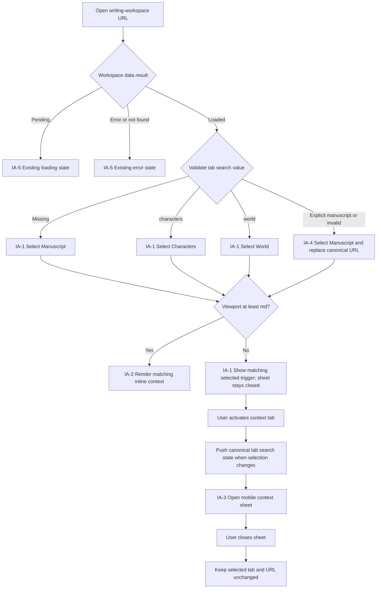
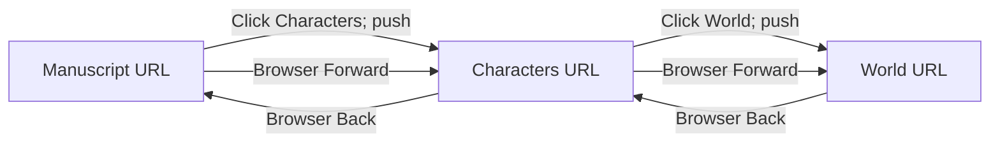

# Writing Workspace Tab URL State UI Plan

## 1. Summary

Make the active contextual tab on `/projects/$projectId/write` restorable from
the URL without changing the writing workspace's visual design. Manuscript is
the canonical default; Characters and World use `?tab=characters` and
`?tab=world`. User tab choices create browser history entries, while explicit
default and invalid values recover through replacement navigation.

This is a navigation-state change to the existing writing workspace. It keeps
the installed shadcn/ui `Tabs` and `Sheet` composition, all current Korean
labels, responsive panel layout, manuscript editing and autosave, AI tooling,
and conflict handling.

## 2. Context and Goals

### Target user

A writer moving between manuscript structure, character context, and world
context while drafting a project.

### Current problem

The selected context is held only in component-local `contextMode` state.
Shared links, reloads, and browser Back/Forward therefore lose the writer's
selected context and return to Manuscript.

### Desired outcome

- A URL identifies the selected writing context.
- Opening or reloading a canonical URL restores that selection.
- Tab clicks and browser history behave like normal navigation.
- Invalid and redundant URL values recover to one canonical default URL.
- Mobile context-sheet visibility remains transient and independent from the
  selected context.
- Manuscript and Story Bible domain ownership is unchanged.

### Primary task

Select Manuscript, Characters, or World context while writing, then reliably
return to or share that selected context through browser navigation.

## 3. Scope and Exclusions

### In scope

- Existing route: `/projects/$projectId/write`.
- Existing vertical context tabs: `원고 보기`, `인물 보기`, `세계관 보기`.
- Validated `tab` search state and its canonical URL representation.
- Direct-link and reload-equivalent restoration.
- Push-history tab changes and Back/Forward replay.
- Replacement canonicalization for redundant or invalid search values.
- Existing mobile left-sheet opening on a tab click and selection retention
  after that sheet closes.
- Focused observable behavior tests for the route and screen.

### Excluded

- Visual restyling, label changes, new content, or new routes.
- URL ownership of the mobile context sheet's open state.
- URL ownership of the AI-tool sheet, active manuscript scene, editor
  selection, autosave state, or conflict dialog.
- Changes to manuscript content, Story Bible data, APIs, persistence,
  authorization, dependencies, or domain contracts.
- Changes to responsive breakpoints, resize behavior, or panel proportions.
- A new shadcn/ui primitive or an adoption/configuration task.

## 4. Requirements

| ID    | Requirement                                                                                      | Acceptance signal                                                                                                                                |
| ----- | ------------------------------------------------------------------------------------------------ | ------------------------------------------------------------------------------------------------------------------------------------------------ |
| REQ-1 | The default writing-workspace URL renders Manuscript as the selected context.                    | `/projects/{projectId}/write` has `원고 보기` selected and no `tab` search parameter.                                                            |
| REQ-2 | Direct Characters and World URLs render the matching selected context.                           | `?tab=characters` selects Characters; `?tab=world` selects World; reload-equivalent initial navigation gives the same result.                    |
| REQ-3 | User tab clicks write canonical search state.                                                    | Characters and World write their values; Manuscript removes `tab`; unrelated future search state is preserved.                                   |
| REQ-4 | Browser Back and Forward replay tab selection.                                                   | The selected trigger, contextual content, and search parameter match each visited tab-history entry.                                             |
| REQ-5 | Explicit Manuscript and malformed or unsupported values replacement-canonicalize.                | `?tab=manuscript` and invalid values render Manuscript and replace the URL with one that omits `tab`, without adding a recovery step to history. |
| REQ-6 | Closing the mobile context sheet retains selected URL state.                                     | After selecting a tab and closing the sheet, the same tab remains selected and the canonical URL remains unchanged.                              |
| REQ-7 | Existing Tabs/Sheet accessibility, layout, autosave, AI, and conflict behavior remain unchanged. | Existing interaction, responsive, editing, save, AI-tool, navigation-guard, and conflict tests remain valid.                                     |

## 5. Confirmed Decisions

1. `tab` accepts exactly `manuscript`, `characters`, or `world` before
   canonicalization.
2. Manuscript is the validated default and is omitted from the canonical URL.
3. Characters and World are represented by `?tab=characters` and
   `?tab=world` respectively.
4. A user choosing a different tab creates a browser history entry. A
   replacement is reserved for canonicalization or invalid-value recovery.
5. The selected context is derived from validated route search state and is
   not duplicated in React local state.
6. Search navigation preserves unrelated search keys so this behavior composes
   with future URL-owned workspace state.
7. Mobile `contextOpen` remains local transient state. Closing the sheet does
   not change tab selection or navigation state.
8. The current installed shadcn/ui `Tabs`, `Sheet`, `Tooltip`, `ScrollArea`,
   and responsive panel composition remain in place.
9. This change does not alter Manuscript or Story Bible domain behavior and
   does not require an API operation.

### Considered approaches

| Approach                                        | Decision and trade-off                                                                                                                  |
| ----------------------------------------------- | --------------------------------------------------------------------------------------------------------------------------------------- |
| Route-owned selected tab                        | **Selected.** One source of truth supports links, reload, canonicalization, and browser history while following frontend routing rules. |
| Local state mirrored to the URL with effects    | Rejected. Two state owners can drift during initial render and Back/Forward, and synchronization effects add avoidable transitions.     |
| Keep local state and only parse the initial URL | Rejected. Direct links improve, but history replay and subsequent external search changes remain incorrect.                             |

## 6. Assumptions and Rationale

- **Mobile direct links select but do not automatically open the context
  sheet.** The approved design keeps sheet visibility local and excludes it
  from URL ownership. On initial mobile navigation, the matching tab is
  selected; activating that existing tab trigger opens the sheet with the
  matching content.
- **Canonicalization should not move focus or announce an error.** Recovery is
  automatic, results in the valid Manuscript state, and does not represent a
  user-correctable form error.
- **Selecting the already-selected tab does not need a duplicate history
  entry.** No visible selected-context transition occurred. On mobile, its
  existing click behavior may still open the context sheet.
- **Loading and project-error states do not need tab-specific variants.** The
  workspace must load successfully before contextual content is available;
  validated search state remains ready for the successful screen.
- **Breakpoint behavior remains `md` for inline context and `xl` for
  resizable desktop panels.** These thresholds are evidenced by the current
  screen and are outside this feature's scope.

## 7. Open Questions

None. The approved design and current screen resolve the URL contract,
canonical default, history semantics, mobile sheet ownership, and regression
boundary.

The mobile direct-link assumption above is non-blocking because auto-opening
the sheet would contradict the explicit decision that `contextOpen` stays
transient and would change existing overlay behavior.

## 8. Information Architecture

### Screen and overlay inventory

| ID   | Surface/state                         | Purpose and entry                                                 | Content and actions                                                                                                       | Requirements               |
| ---- | ------------------------------------- | ----------------------------------------------------------------- | ------------------------------------------------------------------------------------------------------------------------- | -------------------------- |
| IA-1 | Writing workspace — loaded            | Main route after workspace data succeeds.                         | Header, context navigation, manuscript editor, optional AI tools and conflict dialog. Context selection derives from URL. | REQ-1–REQ-7                |
| IA-2 | Inline context panel (`md` and wider) | Permanently visible left of the editor.                           | Scene tree, character context, or world context according to selected tab. Tab triggers change URL selection.             | REQ-1–REQ-5, REQ-7         |
| IA-3 | Mobile context sheet (below `md`)     | Existing left sheet opened by activating a context tab.           | Title matches selected tab; panel content matches URL selection; Close dismisses only the sheet.                          | REQ-2, REQ-3, REQ-6, REQ-7 |
| IA-4 | Canonicalization recovery state       | Route receives explicit default, unsupported, or malformed `tab`. | Manuscript is the valid selected state; route replaces the URL with the canonical no-`tab` form.                          | REQ-1, REQ-5               |
| IA-5 | Existing loading/error states         | Workspace query is pending, failed, or project is missing.        | Existing skeleton, retry, and return-to-library actions; no new tab-specific UI.                                          | REQ-7                      |
| IA-6 | Existing AI and conflict overlays     | Existing user actions or autosave conflict.                       | Behavior and transient ownership remain unchanged by tab URL navigation.                                                  | REQ-7                      |

### Canonical URL mapping

| Selected context    | Accepted input                          | Canonical result                             | History treatment                         |
| ------------------- | --------------------------------------- | -------------------------------------------- | ----------------------------------------- |
| Manuscript          | no `tab`                                | `/projects/{projectId}/write`                | No recovery navigation.                   |
| Manuscript          | `tab=manuscript`                        | `/projects/{projectId}/write`                | Replace.                                  |
| Characters          | `tab=characters`                        | `/projects/{projectId}/write?tab=characters` | Direct load as-is; user selection pushes. |
| World               | `tab=world`                             | `/projects/{projectId}/write?tab=world`      | Direct load as-is; user selection pushes. |
| Manuscript recovery | unknown, malformed, or non-string `tab` | `/projects/{projectId}/write`                | Replace.                                  |

### State table

| Route state           | Selected trigger                                 | Inline content            | Mobile sheet                                                    | URL effect            |
| --------------------- | ------------------------------------------------ | ------------------------- | --------------------------------------------------------------- | --------------------- |
| No `tab`              | `원고 보기`                                      | Scene tree                | Closed initially; opens Scene tree on trigger activation        | None                  |
| `characters`          | `인물 보기`                                      | Character context         | Closed initially; opens Character context on trigger activation | None                  |
| `world`               | `세계관 보기`                                    | World context             | Closed initially; opens World context on trigger activation     | None                  |
| Explicit `manuscript` | `원고 보기`                                      | Scene tree                | Same as default                                                 | Replace to omit `tab` |
| Invalid `tab`         | `원고 보기`; no invalid trigger is ever selected | Scene tree                | Same as default                                                 | Replace to omit `tab` |
| Mobile sheet closes   | Unchanged                                        | Not applicable below `md` | Closed                                                          | Unchanged             |
| Back/Forward          | Matches destination entry                        | Matches destination entry | Open/closed transient state is not reconstructed                | No new entry          |

## 9. User Flow





Failure recovery is limited to route-search recovery: invalid input never
renders an unknown panel, and replacement navigation avoids inserting an
invalid URL as another user-visible history step. Existing data-load, autosave,
and conflict recovery paths remain unchanged.

## 10. Wireframes

### Desktop and tablet — loaded workspace (`md` and wider)

```text
+--------------------------------------------------------------------------+
| [Back] [Logo] Project / active scene                    [Autosave status] |
+------+----------------------+--------------------------------------------+
| [M]* | CONTEXT PANEL        | MANUSCRIPT EDITOR                          |
| [C]  |                      |                                            |
| [W]  | Scene tree OR        | Existing editor content and behavior       |
|      | Characters OR        |                                            |
|      | World                |                                            |
|      |                      |                                            |
| [AI] |                      |                                            |
+------+----------------------+--------------------------------------------+
  * Selected from the validated URL. Clicking a different tab pushes its
    canonical search state. At xl, existing resize handles/panels remain.
```

### Mobile — selected context, sheet closed

```text
+--------------------------------------+
| [Back] Project       [Autosave]       |
+------+-------------------------------+
| [M]  | MANUSCRIPT EDITOR             |
| [C]* |                               |
| [W]  | Characters is selected by URL |
|      |                               |
| [AI] |                               |
+------+-------------------------------+
  Activating [C] opens the existing left sheet. Selection is visible through
  the existing active-tab treatment and accessible selected state.
```

### Mobile — context sheet open

```text
+--------------------------------------+
| 인물 보기                       [X]   |
| 현재 장면과 관련된 집필 정보를...    |
+--------------------------------------+
| 등장인물 / selected context content  |
|                                      |
| Existing scrollable panel            |
+--------------------------------------+

Close behavior:
- dismiss Sheet;
- retain Characters selected;
- retain `?tab=characters`;
- return focus using the existing Sheet/Radix focus behavior.
```

### Canonicalization

```text
Input:  /projects/{id}/write?tab=manuscript
        /projects/{id}/write?tab=unsupported

Visible state: Manuscript selected; no invalid panel or error flash
URL:           /projects/{id}/write
History:       current entry replaced
```

## 11. Responsive Behavior

| Width/state             | Existing composition retained                                                              | URL-state behavior                                                                                                                     |
| ----------------------- | ------------------------------------------------------------------------------------------ | -------------------------------------------------------------------------------------------------------------------------------------- |
| Below `md` (mobile)     | Icon rail + editor; selected context appears in a left `Sheet` only after tab activation.  | URL always determines selected tab/content. Tab activation preserves existing sheet opening. Closing Sheet changes only `contextOpen`. |
| `md` through below `xl` | Fixed 16rem inline context panel + editor; AI tool remains a right Sheet.                  | URL determines inline panel; tab click pushes canonical search state.                                                                  |
| `xl` and wider          | Existing resizable context/editor panels, plus optional resizable AI panel.                | URL determines context panel; resize and AI state remain independent.                                                                  |
| Crossing a breakpoint   | Existing media-query composition changes between Sheet, fixed panel, and resizable panels. | Selected context remains stable because it comes from the route, not the prior composition's local state.                              |

No breakpoint, width, spacing, icon, tooltip placement, or panel-size change is
planned.

## 12. UI States

| State category           | Planned behavior                                                                                                                    |
| ------------------------ | ----------------------------------------------------------------------------------------------------------------------------------- |
| Default/success          | Manuscript selected at the canonical URL with no `tab`.                                                                             |
| Characters/World success | Matching trigger and panel selected from canonical search state.                                                                    |
| Canonicalizing           | Manuscript is the safe visible state while replacement removes explicit default or invalid input. No separate spinner or message.   |
| Loading                  | Existing workspace skeleton remains; no new tab skeleton.                                                                           |
| Empty                    | Not introduced. Existing domain panels own any current empty presentation.                                                          |
| Error                    | Existing workspace load, not-found, autosave, and conflict errors remain. Invalid `tab` is recovered rather than shown as an error. |
| Disabled                 | No new disabled tab state. Existing controls retain their semantics.                                                                |
| Validation               | Route validates `tab`; unsupported/non-string values resolve to Manuscript and replacement-canonicalize.                            |
| Mobile Sheet open        | Sheet title and body match selected URL context.                                                                                    |
| Mobile Sheet closed      | Selected tab and URL persist; editor remains visible.                                                                               |
| History replay           | Trigger and contextual content update from the destination search state without creating another entry.                             |

## 13. Accessibility

- Preserve the current vertical shadcn/ui/Radix `Tabs` semantics: tablist,
  tab, `aria-selected`, associated tabpanel behavior, and the existing
  `aria-label="집필 도메인"`.
- Preserve current accessible tab names: `원고 보기`, `인물 보기`, and
  `세계관 보기`. Tooltips supplement rather than replace these names.
- Preserve Radix vertical-tabs keyboard behavior, including focus movement
  among triggers and activation semantics. URL navigation occurs through the
  same activation callback; no keyboard-only alternate path is introduced.
- Browser Back/Forward updates the selected tab's `aria-selected` state and
  rendered tabpanel to match the URL.
- Preserve visible focus rings from the existing `TabsTrigger` primitive.
- Preserve the Sheet's dialog semantics, title and description, close control,
  Escape dismissal, focus trap, and focus return behavior.
- Closing the mobile Sheet must not move selection to Manuscript or alter the
  URL. Focus restoration remains an overlay concern, separate from route state.
- Canonicalization requires no alert because it recovers automatically to a
  valid default and presents no user action. It must not briefly select or
  expose an unsupported tab.
- Selection remains communicated by the existing active indicator plus
  semantic `aria-selected`; it does not rely on color alone.
- Preserve current autosave status/alert announcements, conflict-dialog focus,
  navigation blocking, and editor labeling.

## 14. shadcn/ui Status and Adoption Assumptions

shadcn/ui is configured and in active use. Evidence reviewed:

- `frontend/components.json` uses the `radix-nova` style and `@/components/ui`
  alias.
- `frontend/package.json` includes `shadcn`, `radix-ui`, and `lucide-react`.
- `frontend/src/components/ui/tabs.tsx` and `sheet.tsx` provide installed local
  primitives.
- The writing workspace imports and composes these local `Tabs`, `Sheet`,
  `Tooltip`, `ScrollArea`, `Button`, `Alert`, and resizable-panel primitives.

No adoption candidates are needed. No primitive should be regenerated,
installed, restyled, or moved for this feature.

## 15. Component Structure

| Layer/component                                     | Classification                            | Responsibility                                                                                 | Required data/state                                                      | Emitted event                                      |
| --------------------------------------------------- | ----------------------------------------- | ---------------------------------------------------------------------------------------------- | ------------------------------------------------------------------------ | -------------------------------------------------- |
| Writing-workspace route                             | Route declaration                         | Validate `tab`, provide typed search state, and recover non-canonical values.                  | Raw search input; validated `ContextMode`.                               | Replacement navigation for canonicalization.       |
| `WritingWorkspacePage` / loaded composition         | Product composition                       | Read selected context from route and coordinate context navigation with existing workspace UI. | Workspace response; selected context; existing transient/workflow state. | Typed tab search navigation.                       |
| Context navigation rail                             | Product composition                       | Present the three existing context tools and AI entry point.                                   | Context tool metadata; URL-selected value; viewport behavior.            | Context-tab activation; existing AI open.          |
| `Tabs`                                              | Available shadcn/ui primitive             | Controlled vertical selected-context structure.                                                | URL-selected value and orientation. No independent selected state.       | Value change from pointer/keyboard activation.     |
| `TabsList` / `TabsTrigger`                          | Available shadcn/ui primitives            | Accessible labeled context navigation and active indication.                                   | Existing labels, icons, selected value.                                  | Tab activation; on mobile also request Sheet open. |
| `TabsContent` / `ContextPanelContent`               | Available primitive + product composition | Render Scene tree, Character context, or World context according to the controlled tab value.  | Manuscript draft; Story Bible; selected Tabs context.                    | Existing child events only.                        |
| Mobile context `Sheet`                              | Available shadcn/ui primitive             | Transiently display the selected contextual panel below `md`.                                  | Local `contextOpen`; URL-selected title/content.                         | Open/close only; never tab navigation on close.    |
| Inline/resizable layout                             | Existing product composition              | Display selected context beside editor at wider widths.                                        | Existing media-query and panel-size state.                               | Existing resize events only.                       |
| AI Sheet/panel, autosave indicator, conflict dialog | Existing product compositions             | Preserve assistant, save feedback, and conflict workflows.                                     | Existing local/workflow state.                                           | Existing events unchanged.                         |

The route owns validation; the page owns the concise typed navigation callback;
the reusable shadcn/ui primitives remain unaware of route-tree internals.

## 16. Requirement Traceability Matrix

| Requirement | IA/state/flow                         | Wireframe or component                         | Verification focus                                                                                                             |
| ----------- | ------------------------------------- | ---------------------------------------------- | ------------------------------------------------------------------------------------------------------------------------------ |
| REQ-1       | IA-1, IA-2; no-`tab` state            | Desktop default; route + controlled Tabs       | Initial canonical URL shows Manuscript and omits `tab`.                                                                        |
| REQ-2       | IA-1–IA-3; Characters/World states    | Desktop/mobile; Tabs + contextual content      | Direct initial URLs and reload-equivalent navigation select matching trigger/content.                                          |
| REQ-3       | IA-1–IA-3; tab-choice flow            | Context rail; typed page navigation            | Click each tab; assert visible selection and canonical search, including removal for Manuscript.                               |
| REQ-4       | History flow; history-replay state    | Route + controlled Tabs                        | Characters → World → Back/Forward; assert URL, trigger, and panel together.                                                    |
| REQ-5       | IA-4; canonicalization flow           | Canonicalization wireframe; route              | Explicit Manuscript and invalid inputs render default and replace rather than push.                                            |
| REQ-6       | IA-3; mobile close flow               | Mobile Sheet wireframe                         | Select tab, close Sheet, assert dialog closed while URL/selected trigger stay unchanged.                                       |
| REQ-7       | IA-1, IA-5, IA-6; all retained states | Existing Tabs/Sheet and workspace compositions | Existing focused screen suite plus full frontend checks; no visual, domain, API, autosave, AI, conflict, or layout regression. |

## 17. Implementation Considerations

- Keep search validation in
  `frontend/src/routes/projects.$projectId.write.tsx`; keep the route adapter
  thin.
- Derive the controlled `Tabs` value in the page from typed validated search
  state. Remove local ownership of `contextMode`; do not mirror route state in
  an effect or ref.
- Use typed TanStack Router search navigation. Update only `tab` and preserve
  other search keys. Omit `tab` for Manuscript.
- Use normal push behavior for a changed user selection. Use replacement only
  for explicit default or invalid-value canonicalization.
- Preserve the mobile trigger's existing ability to open the context Sheet,
  including when the already-selected trigger is activated after a direct
  link.
- Keep `contextOpen`, `assistantOpen`, editor selection, autosave, navigation
  guard, and conflict state unchanged and local to their current owners.
- Do not hand-edit generated `frontend/src/routeTree.gen.ts`; let the existing
  TanStack Router generation workflow update it if its generated typing changes.
- Extend `writing-workspace-page.test.tsx` through the existing application
  route tree and memory history. Assert both observable tab/panel state and
  router search state for direct URLs, clicks, canonicalization, and
  Back/Forward.
- Focused tests should distinguish push navigation from replacement by proving
  history replay and ensuring recovery does not create an extra invalid/default
  step.
- Retain and extend the existing mobile-sheet test for REQ-6. Existing tests
  remain the regression baseline for REQ-7.
- No API, MSW handler, domain document, package, or dependency change is
  required.

## 18. Self-review Results

- **Traceability:** Pass. REQ-1 through REQ-7 each map to IA, flow/state,
  component/wireframe, and verification coverage.
- **IA and flow consistency:** Pass. Every IA surface appears in a flow or is
  explicitly retained as an existing unaffected state.
- **Interaction coverage:** Pass. Direct entry, tab selection, canonicalization,
  Back/Forward, mobile open/close, loading/error retention, and overlays are
  addressed.
- **Responsive coverage:** Pass. Mobile, fixed inline, resizable desktop, and
  breakpoint transitions are specified without changing layout.
- **Accessibility coverage:** Pass. Tab semantics and keyboard behavior, active
  state, focus visibility, Sheet labeling/dismissal/focus return, and existing
  announcements are retained.
- **shadcn/ui accuracy:** Pass. Existing installed primitives are distinguished
  from product compositions; there are no adoption candidates.
- **Domain/API boundary:** Pass. No Manuscript or Story Bible behavior, API
  shape, persistence, security, or policy was invented.
- **Assumptions and questions:** Pass. One narrow mobile direct-link assumption
  is explicit and follows the approved transient-sheet decision; no unresolved
  material question remains.
- **Scope/placeholder scan:** Pass. No TBD/TODO placeholders, unrelated
  redesign, or implementation work is included.
